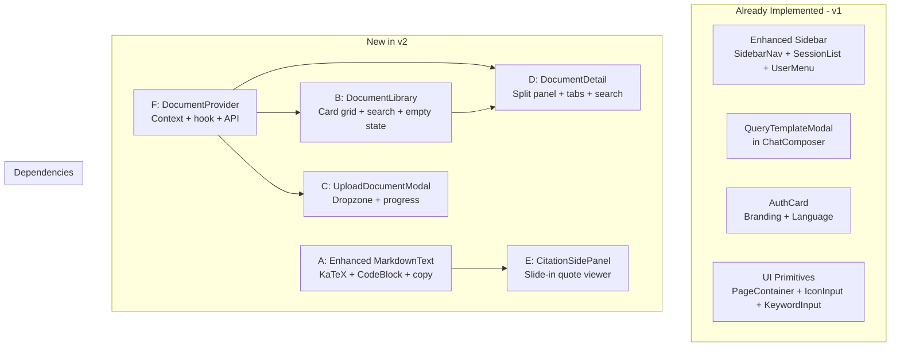
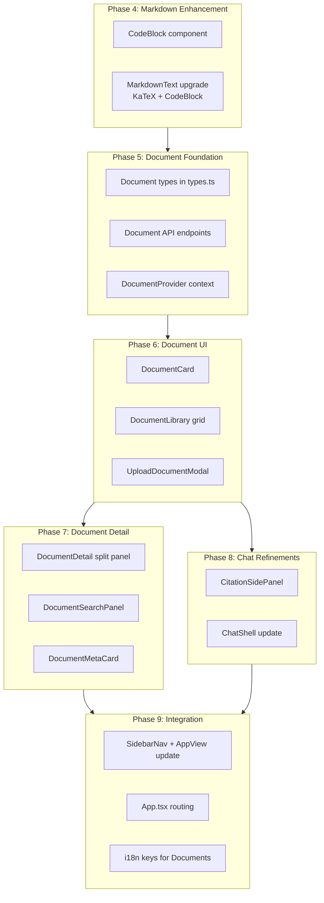

# FastGPT → ScholarSight UI Adaptation Plan v2

## Status: Awaiting Approval

---

## 0. Executive Summary

This is the **updated** adaptation plan. The [original plan](fastgpt-ui-adaptation-plan.md) identified 7 core UI patterns from FastGPT. **All 7 have been implemented.** This v2 plan identifies **6 additional high-value UI patterns** from the FastGPT reference that were not covered in the original plan, plus refinements to already-implemented components.

### Already Completed (v1 Plan)

| # | Component | Status |
|---|-----------|--------|
| 1 | `PageContainer` — rounded card wrapper | ✅ Done |
| 2 | `IconInput` — input with icon slots | ✅ Done |
| 3 | `KeywordInput` — tag-style chip input | ✅ Done |
| 4 | `SidebarNav` — view navigation | ✅ Done |
| 5 | `SessionList` — chat history with pin/rename/delete | ✅ Done |
| 6 | `SidebarUserMenu` — avatar dropdown | ✅ Done |
| 7 | `Enhanced Sidebar` — composes nav + sessions + user | ✅ Done |
| 8 | `QueryTemplateModal` — academic prompt templates | ✅ Done |
| 9 | `ChatComposer` upgrade — template button added | ✅ Done |
| 10 | `AuthCard` upgrade — branding header + language selector | ✅ Done |

### New Components in This Plan (v2)

| # | FastGPT Source | ScholarSight Adaptation | Priority |
|---|---------------|------------------------|----------|
| A | `Markdown/index.tsx` + `CodeLight.tsx` | **Enhanced MarkdownText** — KaTeX math, Mermaid diagrams, code copy button | High |
| B | `dataset/list/List.tsx` + `SideTag.tsx` | **DocumentLibrary** — card grid for uploaded papers/documents | High |
| C | `dataset/list/CreateModal.tsx` | **UploadDocumentModal** — modal form for uploading new documents | High |
| D | `dataset/detail/index.tsx` + `Test/index.tsx` | **DocumentDetail** — split-panel document viewer with search/test | Medium |
| E | `chat/index.tsx` quote panel pattern | **CitationSidePanel** — slide-out citation viewer alongside chat | Medium |
| F | `dataset/list/context.tsx` | **DocumentProvider** — context provider for document collection state | High |

---

## 1. Component A: Enhanced MarkdownText

### Source Analysis

FastGPT's Markdown renderer at [`Markdown/index.tsx`](../FastGPT-reference/components/Markdown/index.tsx) supports:
- **Math rendering** via `remark-math` + `rehype-katex`
- **Mermaid diagram** rendering via dynamic `MermaidCodeBlock`
- **Code syntax highlighting** with language label + copy button via [`CodeLight.tsx`](../FastGPT-reference/components/Markdown/codeBlock/CodeLight.tsx)
- **External link handling** via `rehype-external-links` with `target="_blank"`
- **GFM tables** via custom `MarkdownTable` component
- **Large content fallback** — raw text for sources over 200K chars

### Current ScholarSight State

[`MarkdownText.tsx`](../frontend/src/components/chat/MarkdownText.tsx) is minimal — only `ReactMarkdown` + `remarkGfm`. No math, no code highlighting, no copy button.

### Adaptation Plan

```
ScholarSight already has these dependencies installed:
- react-markdown ✅
- remark-gfm ✅
- remark-math ✅
- rehype-katex ✅ (devDependency for katex)
- react-syntax-highlighter ✅

Missing: rehype-external-links (optional, can use remark-gfm link handling)
```

**What to build:**

1. **`CodeBlock` component** — adapted from FastGPT `CodeLight`:
   - Dark header bar with language name + copy button
   - `react-syntax-highlighter` with VS Code Dark+ theme
   - Inline code styling for non-block code spans

2. **Upgrade `MarkdownText`** to add:
   - `remark-math` + `rehype-katex` plugins (already installed)
   - Custom `code` renderer → `CodeBlock`
   - Custom `pre` handler to pass `codeBlock` flag
   - Mermaid support (deferred — can add later)
   - Large content fallback for performance

**Files:**
- `NEW` `frontend/src/components/chat/CodeBlock.tsx`
- `MODIFY` `frontend/src/components/chat/MarkdownText.tsx`

---

## 2. Component B: DocumentLibrary

### Source Analysis

FastGPT's [`List.tsx`](../FastGPT-reference/pageComponents/dataset/list/List.tsx) renders a responsive grid of dataset cards with:
- Avatar + name + type tag
- Description text with 3-line ellipsis
- Owner info + permission indicator
- Hover effects: border highlight + reveal more-menu
- Context menu: Edit, Move, Permission, Export, Delete
- Folder navigation support
- Empty state with tip

### Adaptation for ScholarSight

Map FastGPT "Datasets" → ScholarSight "Documents" (uploaded papers, reference materials).

**Contextualization:**
- "Dataset" → "Document"
- "Create Dataset" → "Upload Document"  
- "Folder" → "Collection" (group of related documents)
- "Vector Model" → "Processing Status" (OCR/embedding status)
- Dataset type tag → Document type badge (PDF, Image, Text)
- Permission icons → not needed (single-user for MVP)

**What to build:**

1. **`DocumentCard` component** — single document card:
   - Document icon/thumbnail + title
   - Description/abstract preview (3-line clamp)
   - Type badge (PDF, Image, etc.)
   - Processing status indicator
   - Hover: border highlight + context menu
   - Context menu: View, Rename, Delete

2. **`DocumentLibrary` component** — grid container:
   - Responsive grid: 1 col mobile → 2 cols → 3 cols → 4 cols desktop
   - Search/filter bar at top
   - Empty state when no documents
   - "Upload Document" action button

3. **Add "Documents" to `AppView`** — new view in the sidebar navigation

**Files:**
- `NEW` `frontend/src/components/documents/DocumentCard.tsx`
- `NEW` `frontend/src/components/documents/DocumentLibrary.tsx`
- `MODIFY` `frontend/src/lib/types.ts` — add `AppView = "documents"`, document types
- `MODIFY` `frontend/src/components/layout/SidebarNav.tsx` — add Documents nav item
- `MODIFY` `frontend/src/App.tsx` — add Documents view route

---

## 3. Component C: UploadDocumentModal

### Source Analysis

FastGPT's [`CreateModal.tsx`](../FastGPT-reference/pageComponents/dataset/list/CreateModal.tsx) is a form modal with:
- Avatar selector with upload
- Name input with placeholder
- Model selectors (vector model, agent model, VLM model)
- API dataset form (conditional)
- Create/Close buttons
- Form validation via `react-hook-form`

### Adaptation for ScholarSight

**Contextualization:**
- "Create Dataset" → "Upload Document"
- Avatar → Document type icon (auto-detected from file)
- Model selectors → not needed (backend auto-selects processing pipeline)
- API dataset form → File upload dropzone

**What to build:**

1. **`UploadDocumentModal` component** — dialog with:
   - File dropzone (drag-and-drop + click to browse)
   - Accepted types: PDF, PNG, JPG, TXT
   - File preview (name, size, type icon)
   - Optional: title override input, description textarea
   - Upload button with progress indicator
   - Wired to backend upload API

**Files:**
- `NEW` `frontend/src/components/documents/UploadDocumentModal.tsx`

---

## 4. Component D: DocumentDetail (Split Panel)

### Source Analysis

FastGPT's [`dataset/detail/index.tsx`](../FastGPT-reference/pages/dataset/detail/index.tsx) uses a split-panel layout:
- **Left panel** (flex 1): Tab navigation (Collection, Test, Data, Import) + content area
- **Right panel** (fixed width 17-20rem): Info sidebar or metadata card
- Mobile: stacked single-column with tab navigation

The [`Test/index.tsx`](../FastGPT-reference/pageComponents/dataset/detail/Test/index.tsx) component has:
- Input panel (search query + image upload)
- Test history list
- Results panel showing matched chunks

### Adaptation for ScholarSight

Map to a "Document Viewer" page where users can:
- View extracted text/OCR output of an uploaded document
- Search within the document
- View document metadata (pages, processing status, upload date)
- Ask questions specifically about this document

**What to build:**

1. **`DocumentDetail` component** — split-panel layout:
   - **Left**: Document content viewer (extracted text/markdown)
   - **Right sidebar**: Document metadata card (title, type, pages, status, upload date)
   - Tab navigation: Content | Search | Q&A
   - Mobile: stacked layout

2. **`DocumentSearchPanel`** — adapted from FastGPT Test:
   - Search input for semantic search within document
   - Results list showing matched text chunks with relevance scores

**Files:**
- `NEW` `frontend/src/components/documents/DocumentDetail.tsx`
- `NEW` `frontend/src/components/documents/DocumentSearchPanel.tsx`
- `NEW` `frontend/src/components/documents/DocumentMetaCard.tsx`

---

## 5. Component E: CitationSidePanel

### Source Analysis

FastGPT's [`chat/index.tsx`](../FastGPT-reference/pages/chat/index.tsx) has a citation/quote panel pattern:
```tsx
{datasetCiteData && (
  <PageContainer flex="1 0 0" w={0} maxW="560px">
    <ChatQuoteList metadata={...} rawSearch={...} onClose={...} />
  </PageContainer>
)}
```

This renders a side panel alongside the chat when a citation is clicked, showing the full source context.

### Current ScholarSight State

ScholarSight uses a modal ([`CitationModal.tsx`](../frontend/src/components/chat/CitationModal.tsx)) for citations — it overlays the entire screen. FastGPT's pattern is better UX: a slide-in side panel that shows alongside the chat.

### Adaptation

**What to build:**

1. **`CitationSidePanel` component** — slide-in panel:
   - Opens from the right side when a citation chip is clicked
   - Shows: document title, component type, summary, relevance score
   - Image preview if `image_url` is available
   - Close button to dismiss
   - Does NOT obscure the chat (side-by-side layout)

2. **Update `ChatShell`** — change from modal to side-panel pattern:
   - When citation selected: main content area splits (chat shrinks, panel slides in)
   - Responsive: on mobile, still use modal overlay

**Files:**
- `NEW` `frontend/src/components/chat/CitationSidePanel.tsx`
- `MODIFY` `frontend/src/components/chat/ChatShell.tsx` — swap modal → side panel

---

## 6. Component F: DocumentProvider (Context)

### Source Analysis

FastGPT's [`context.tsx`](../FastGPT-reference/pageComponents/dataset/list/context.tsx) provides:
- `myDatasets` — list of documents
- `loadMyDatasets()` — fetch/refresh
- `onDelDataset()` — delete
- `onUpdateDataset()` — update metadata
- `searchKey` + `setSearchKey` — filter
- `paths` — folder breadcrumb navigation
- Loading/fetching states

### Adaptation for ScholarSight

**What to build:**

1. **`DocumentProvider` context** — manages document collection state:
   - `documents: DocumentItem[]` — list from backend
   - `loadDocuments()` — fetch from API
   - `uploadDocument(file)` — upload + refresh
   - `deleteDocument(id)` — delete + refresh
   - `searchKey` / `setSearchKey` — filter
   - `isLoading` state

2. **`useDocuments` hook** — convenience accessor for the context

3. **Document types** in `types.ts`:
   ```typescript
   interface DocumentItem {
     id: string;
     title: string;
     description?: string;
     type: "pdf" | "image" | "text";
     status: "processing" | "ready" | "error";
     pageCount?: number;
     uploadedAt: string;
     fileSize: number;
   }
   ```

**Files:**
- `NEW` `frontend/src/providers/DocumentProvider.tsx`
- `NEW` `frontend/src/hooks/useDocuments.ts`
- `MODIFY` `frontend/src/lib/types.ts` — add document types
- `MODIFY` `frontend/src/lib/api.ts` — add document API endpoints

---

## 7. Architecture Overview



---

## 8. Implementation Order



---

## 9. New i18n Keys Required

```json
{
  "documents": {
    "title": "Documents",
    "upload": "Upload Document",
    "uploadDesc": "Drag and drop or click to upload a document",
    "acceptedTypes": "Accepted: PDF, PNG, JPG, TXT",
    "uploading": "Uploading...",
    "processing": "Processing...",
    "ready": "Ready",
    "error": "Processing failed",
    "noDocuments": "No documents yet. Upload your first paper to get started.",
    "search": "Search documents...",
    "view": "View",
    "rename": "Rename",
    "delete": "Delete",
    "deleteConfirm": "Delete this document?",
    "deleteWarning": "This will permanently remove the document and its extracted data.",
    "type": {
      "pdf": "PDF",
      "image": "Image",
      "text": "Text"
    },
    "detail": {
      "content": "Content",
      "search": "Search",
      "qa": "Q&A",
      "metadata": "Document Info",
      "pages": "Pages",
      "uploadedAt": "Uploaded",
      "fileSize": "File Size",
      "status": "Status"
    }
  },
  "citation": {
    "panelTitle": "Source Details",
    "relevance": "Relevance",
    "documentType": "Type",
    "close": "Close Panel"
  }
}
```

---

## 10. New Dependencies

| Package | Purpose | Already Installed? |
|---------|---------|-------------------|
| `rehype-katex` | Math rendering in markdown | ✅ Yes |
| `remark-math` | Math syntax parsing | ✅ Yes |
| `react-syntax-highlighter` | Code syntax highlighting | ✅ Yes |
| `katex` | KaTeX CSS | ✅ Yes (devDep) |
| `react-dropzone` | File upload dropzone | ❌ Need to install |

Only **one new dependency** needed: `react-dropzone` for the file upload modal. Alternatively, we can build a simple native drag-and-drop implementation to avoid the extra dependency.

---

## 11. Files Summary

### New Files (11)
| File | Adapted From |
|------|-------------|
| `frontend/src/components/chat/CodeBlock.tsx` | FastGPT `Markdown/codeBlock/CodeLight.tsx` |
| `frontend/src/components/chat/CitationSidePanel.tsx` | FastGPT `chat/index.tsx` quote panel pattern |
| `frontend/src/components/documents/DocumentCard.tsx` | FastGPT `dataset/list/List.tsx` card pattern |
| `frontend/src/components/documents/DocumentLibrary.tsx` | FastGPT `dataset/list/List.tsx` grid + empty state |
| `frontend/src/components/documents/UploadDocumentModal.tsx` | FastGPT `dataset/list/CreateModal.tsx` |
| `frontend/src/components/documents/DocumentDetail.tsx` | FastGPT `dataset/detail/index.tsx` split panel |
| `frontend/src/components/documents/DocumentSearchPanel.tsx` | FastGPT `dataset/detail/Test/index.tsx` |
| `frontend/src/components/documents/DocumentMetaCard.tsx` | FastGPT `dataset/detail/index.tsx` info sidebar |
| `frontend/src/providers/DocumentProvider.tsx` | FastGPT `dataset/list/context.tsx` |
| `frontend/src/hooks/useDocuments.ts` | Convenience hook for DocumentProvider |
| `frontend/src/components/documents/index.ts` | Barrel export file |

### Modified Files (6)
| File | Changes |
|------|---------|
| `frontend/src/components/chat/MarkdownText.tsx` | Add KaTeX, CodeBlock, external links |
| `frontend/src/components/chat/ChatShell.tsx` | Replace CitationModal with CitationSidePanel |
| `frontend/src/lib/types.ts` | Add DocumentItem, AppView "documents" |
| `frontend/src/lib/api.ts` | Add document CRUD API endpoints |
| `frontend/src/components/layout/SidebarNav.tsx` | Add Documents nav item |
| `frontend/src/App.tsx` | Add Documents view routing + DocumentProvider |

### i18n Files (2)
| File | Changes |
|------|---------|
| `frontend/src/i18n/locales/en/common.json` | Add documents + citation keys |
| `frontend/src/i18n/locales/vi/common.json` | Add Vietnamese translations |

---

## 12. What We Are Still NOT Taking from FastGPT

| FastGPT Component | Reason to Skip |
|---|---|
| `Layout/index.tsx` (auth + model checks + notifications) | ScholarSight has `AuthProvider` + `App.tsx` boot machine |
| `HelperBot.tsx` | FastGPT-specific support chatbot |
| Wallet / billing / pricing components | Not applicable to ScholarSight |
| `MemberManager`, team permissions | Single-user MVP; no team features |
| Workflow / agent / skill pages | Different product domain |
| `WechatForm.tsx`, OAuth providers | Platform-specific auth methods |
| `RegisterForm.tsx` / `ForgetPasswordForm.tsx` | ScholarSight has working auth forms |
| Dataset folder drag-and-drop (`useFolderDrag`) | Over-complex for document management MVP |
| Dataset export CSV | Different data model |
| `Mermaid` / `ECharts` code blocks | Low priority; can add later |
| `Video` / `Audio` code blocks | Not needed for academic context |
