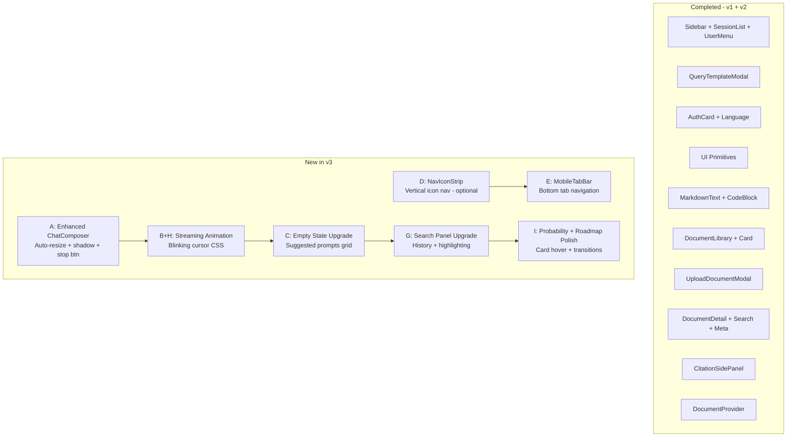
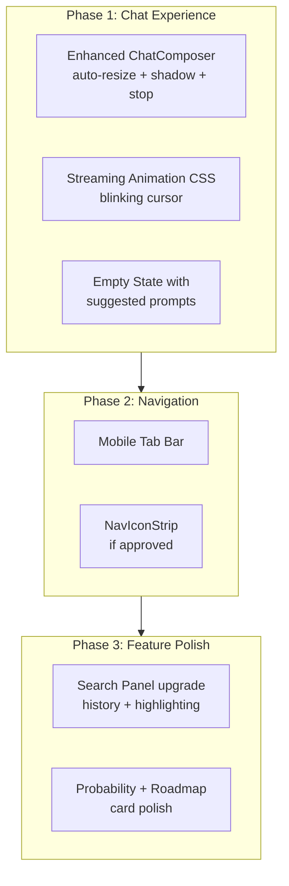

# FastGPT → ScholarSight UI Adaptation Plan v3

## Status: Awaiting Approval

---

## 0. Executive Summary

This is the **v3** plan. Plans v1 and v2 have been **fully implemented**, delivering:
- Enhanced Sidebar (nav + sessions + user menu)
- QueryTemplateModal + ChatComposer upgrade
- AuthCard branding + language selector
- UI primitives (PageContainer, IconInput, KeywordInput)
- Enhanced MarkdownText (KaTeX, CodeBlock with syntax highlighting + copy)
- DocumentLibrary (card grid + search + upload + delete)
- UploadDocumentModal (drag-drop + file validation + progress)
- DocumentDetail (split-panel with tabs: Content | Search | Q&A)
- CitationSidePanel (slide-in panel alongside chat)
- DocumentProvider (context + state management)

### What remains — identified through deep analysis of FastGPT patterns vs. current ScholarSight state:

| # | Adaptation | FastGPT Source | Priority |
|---|-----------|---------------|----------|
| A | **Enhanced Chat Composer** — file attachments, auto-resize textarea, rounded container with shadow, paste-to-upload | `HelperBot/Chatinput.tsx` | High |
| B | **Streaming Cursor Animation** — blinking cursor while AI generates | `Markdown/index.module.scss` | Medium |
| C | **Chat Empty State Upgrade** — suggested prompts grid, feature highlights | `HelperBot/index.tsx` + `Markdown/chat/Guide.tsx` | High |
| D | **Navbar Vertical Icon Strip** — desktop fixed-position icon-only nav with tooltips + active shadow | `Layout/navbar.tsx` | Medium |
| E | **Mobile Bottom Tab Bar** — phone-friendly bottom navigation | `Layout/navbarPhone.tsx` | Medium |
| F | **Collapsible SideBar with Edge Toggle** — floating toggle handle at sidebar edge | `SideBar/index.tsx` | Low |
| G | **Dataset Search Test Panel** — full test UI with input + results + image upload | `dataset/detail/Test/index.tsx` | Medium |
| H | **Markdown Streaming Animation CSS** — waiting indicator + blinking cursor for streaming content | `Markdown/index.module.scss` | High |
| I | **Probability & Roadmap UI Polish** — card-based layouts adapted from FastGPT's visual patterns | `dataset/list/List.tsx` card hover patterns | Medium |

---

## 1. Component A: Enhanced Chat Composer

### Source Analysis

FastGPT's [`HelperBot/Chatinput.tsx`](../FastGPT-reference/components/core/chat/HelperBot/Chatinput.tsx) has a sophisticated chat input:
- **Auto-resize textarea** — grows with content up to a max height, then shows scrollbar
- **Rounded container with elevated shadow** — the entire input area has a card-like feel with `border-radius: xl/xxl`, `boxShadow`, and focus-active state
- **File attachment button** with divider separator before the send button
- **Paste-to-upload** — clipboard paste intercept for images and documents
- **Drag-and-drop file upload** directly onto the composer area
- **Send button** — changes state: disabled → active → stop (when streaming)
- **Stop button** during generation (replaces send icon)

### Current ScholarSight State

[`ChatComposer.tsx`](../frontend/src/components/chat/ChatComposer.tsx) is functional but basic:
- Fixed single-row textarea with no auto-resize
- Simple layout: template button | textarea | send button
- No file attachment support
- No stop-generation button
- Flat styling with standard border

### Adaptation Plan

**What to build:**

1. **Auto-resize textarea** — dynamically adjusts height based on content (min 1 row, max ~6 rows, then scroll)
2. **Elevated card container** — rounded-2xl wrapper with shadow that intensifies on focus, matching FastGPT's polish
3. **Stop button** — when `isStreaming`, show a stop icon instead of send, wired to abort controller
4. **File attachment zone** — optional attachment button + paste-to-upload for images (future: PDFs)
5. **Drag-and-drop overlay** — visual indicator when dragging files over the composer

**Files:**
- `MODIFY` `frontend/src/components/chat/ChatComposer.tsx`

---

## 2. Component B + H: Streaming Animation CSS

### Source Analysis

FastGPT's [`Markdown/index.module.scss`](../FastGPT-reference/components/Markdown/index.module.scss) provides:
- `.animation` class — a blinking cursor placeholder while waiting for the first token
- `.waitingAnimation` class — appends a blinking cursor to the last child of the markdown output during streaming
- `@keyframes blink` — 0.6s blink cycle

### Current ScholarSight State

No streaming animation. Messages appear without any visual indicator that content is being generated.

### Adaptation Plan

**What to build:**

1. **Blinking cursor CSS** — add `@keyframes blink` and `.streaming-cursor` utility class to `globals.css`
2. **Apply to `MarkdownText`** — add an optional `isStreaming` prop that appends the cursor pseudo-element
3. **Apply to `MessageBubble`** — pass `isStreaming` to the last AI message bubble

**Files:**
- `MODIFY` `frontend/src/globals.css` — add streaming cursor keyframes + utility class
- `MODIFY` `frontend/src/components/chat/MarkdownText.tsx` — add `isStreaming` prop
- `MODIFY` `frontend/src/components/chat/MessageBubble.tsx` — pass streaming state
- `MODIFY` `frontend/src/components/chat/ChatMessages.tsx` — pass `isStreaming` to last message

---

## 3. Component C: Chat Empty State Upgrade

### Source Analysis

FastGPT's chat interfaces use guide components:
- [`Markdown/chat/Guide.tsx`](../FastGPT-reference/components/Markdown/chat/Guide.tsx) — renders suggested prompts as clickable cards/buttons
- [`Markdown/chat/QuestionGuide.tsx`](../FastGPT-reference/components/Markdown/chat/QuestionGuide.tsx) — follow-up question suggestions
- The overall pattern: empty chat shows a branded header + suggested question grid that auto-fills the composer

### Current ScholarSight State

[`EmptyState.tsx`](../frontend/src/components/chat/EmptyState.tsx) shows:
- An emoji, a title, a hint, and an example — plain text, not interactive

### Adaptation Plan

**What to build:**

1. **Suggested prompts grid** — 2x2 or 3-column grid of clickable prompt cards
2. **Each card** has: icon + title + short description
3. **On click** → fills the composer textarea with the prompt text
4. **Feature highlights** — brief capability summary below the grid
5. **Academic context** — prompts tailored to ScholarSight use cases: summarize papers, compare methodologies, explain concepts, find citations

**Files:**
- `MODIFY` `frontend/src/components/chat/EmptyState.tsx`
- `MODIFY` `frontend/src/components/chat/ChatShell.tsx` — pass `onSendFromSuggestion` handler

---

## 4. Component D: Navbar Vertical Icon Strip (Desktop)

### Source Analysis

FastGPT's [`Layout/navbar.tsx`](../FastGPT-reference/components/Layout/navbar.tsx):
- **Fixed 64px wide vertical strip** on the left side of the viewport
- **Logo at top**, nav items in the middle, user avatar at bottom
- Each nav item: icon + small label text, 48x58px clickable area
- **Active state**: white background + box-shadow card elevation
- **Hover state**: semi-transparent white background
- Notifications badge support
- Clean, icon-centric design ideal for knowledge-heavy apps

### Current ScholarSight State

ScholarSight uses a **collapsible sidebar** (272px expanded, 0px collapsed) with text-based navigation. This works well but differs from FastGPT's always-visible icon strip approach.

### Adaptation Plan

This is an **alternative layout mode** that can coexist with the current sidebar. The idea is to add a slim icon strip that's always visible on desktop, providing quick access to views without expanding the sidebar.

**What to build:**

1. **`NavIconStrip` component** — 56px wide vertical strip
2. **Logo** at top (GraduationCap icon)
3. **Nav items**: Chat, Documents, Probability, Roadmap, Settings — each as an icon with tooltip
4. **Active state**: card-like elevation with primary color
5. **User avatar** at bottom — click to open user menu
6. **Integration**: renders between the icon strip and the main content area, replacing the current sidebar toggle pattern on desktop

**Decision needed**: This is a larger layout change. We can either:
- **(Option 1)** Replace the current sidebar with icon strip + slide-out panel
- **(Option 2)** Keep current sidebar and add icon strip as an option in settings
- **(Option 3)** Skip this component and focus on other improvements

**Files (if approved):**
- `NEW` `frontend/src/components/layout/NavIconStrip.tsx`
- `MODIFY` `frontend/src/App.tsx` — integrate as alternative layout

---

## 5. Component E: Mobile Bottom Tab Bar

### Source Analysis

FastGPT's [`Layout/navbarPhone.tsx`](../FastGPT-reference/components/Layout/navbarPhone.tsx):
- **50px fixed bottom bar** with 4-5 tab items
- Each tab: icon + label, scaled down (0.9x)
- Active state: primary color
- Badge support for notifications

### Current ScholarSight State

Mobile uses a **slide-out Sheet** sidebar triggered by hamburger menu. No persistent bottom tab bar.

### Adaptation Plan

**What to build:**

1. **`MobileTabBar` component** — fixed bottom bar visible on mobile only (`lg:hidden`)
2. **Tab items**: Chat, Documents, Probability, Roadmap — icon + small label
3. **Active state**: primary color highlight
4. **Hide when keyboard is open** (detect via viewport height change)
5. **Integration**: renders at the bottom of the main content area on mobile, replaces the hamburger-triggered sheet sidebar

**Files:**
- `NEW` `frontend/src/components/layout/MobileTabBar.tsx`
- `MODIFY` `frontend/src/App.tsx` — add mobile tab bar for small screens

---

## 6. Component G: Enhanced Document Search Panel

### Source Analysis

FastGPT's [`dataset/detail/Test/index.tsx`](../FastGPT-reference/pageComponents/dataset/detail/Test/index.tsx) has a comprehensive search test UI with:
- Search query input with image upload support
- Test history list (previous queries saved)
- Results showing matched chunks with scores
- Search parameters display

### Current ScholarSight State

[`DocumentSearchPanel.tsx`](../frontend/src/components/documents/DocumentSearchPanel.tsx) is functional but minimal:
- Text input + search button
- Results list with relevance bars
- No search history, no parameter controls

### Adaptation Plan

**What to build:**

1. **Search history** — save last 5 queries in session storage, show as clickable chips
2. **Search parameters tooltip** — show top_k and threshold settings
3. **Result highlighting** — bold/highlight the matching terms in chunk text
4. **Result count badge** — show "X results found" header

**Files:**
- `MODIFY` `frontend/src/components/documents/DocumentSearchPanel.tsx`

---

## 7. Component I: Probability & Roadmap UI Polish

### Source Analysis

FastGPT's card patterns from [`dataset/list/List.tsx`](../FastGPT-reference/pageComponents/dataset/list/List.tsx):
- Cards with hover border color change
- Box shadow elevation transitions
- Consistent spacing and padding
- Type tags with color coding

### Current ScholarSight State

[`ProbabilityShell.tsx`](../frontend/src/components/probability/ProbabilityShell.tsx) — functional form + result display, but uses basic Card components without the polished hover/transition effects.

[`RoadmapShell.tsx`](../frontend/src/components/roadmap/RoadmapShell.tsx) — working Kanban board but task cards lack the hover elevation and transition polish from FastGPT.

### Adaptation Plan

**What to build:**

1. **ProbabilityShell polish**:
   - Input form card with subtle shadow and focus ring
   - Result card with animated tier badge entrance
   - Historical cutoffs rendered as mini chart or styled table
   - Better select dropdowns using shadcn Select component

2. **RoadmapShell polish**:
   - Task cards with hover elevation transition
   - Column headers with count badges
   - Drag indicators on task cards
   - Better empty column state

**Files:**
- `MODIFY` `frontend/src/components/probability/ProbabilityShell.tsx`
- `MODIFY` `frontend/src/components/roadmap/RoadmapShell.tsx`

---

## 8. Architecture Overview



---

## 9. Implementation Order



---

## 10. Detailed File Change Matrix

### Phase 1: Chat Experience (High Priority)

| File | Action | Changes |
|------|--------|---------|
| `frontend/src/components/chat/ChatComposer.tsx` | MODIFY | Auto-resize textarea, elevated card container, stop button, optional file attach |
| `frontend/src/globals.css` | MODIFY | Add `@keyframes blink-cursor`, `.streaming-cursor` utility |
| `frontend/src/components/chat/MarkdownText.tsx` | MODIFY | Add `isStreaming` prop for cursor animation |
| `frontend/src/components/chat/MessageBubble.tsx` | MODIFY | Pass `isStreaming` to last AI message |
| `frontend/src/components/chat/ChatMessages.tsx` | MODIFY | Pass `isStreaming` flag to last message bubble |
| `frontend/src/components/chat/EmptyState.tsx` | MODIFY | Suggested prompts grid with click-to-fill |
| `frontend/src/components/chat/ChatShell.tsx` | MODIFY | Wire empty state prompt clicks to composer |

### Phase 2: Navigation (Medium Priority)

| File | Action | Changes |
|------|--------|---------|
| `frontend/src/components/layout/MobileTabBar.tsx` | NEW | Bottom tab bar for mobile |
| `frontend/src/App.tsx` | MODIFY | Add MobileTabBar for small screens |
| `frontend/src/components/layout/NavIconStrip.tsx` | NEW | Vertical icon strip - if approved |

### Phase 3: Feature Polish (Medium Priority)

| File | Action | Changes |
|------|--------|---------|
| `frontend/src/components/documents/DocumentSearchPanel.tsx` | MODIFY | Search history, result highlighting, count badge |
| `frontend/src/components/probability/ProbabilityShell.tsx` | MODIFY | Card shadows, select components, animated results |
| `frontend/src/components/roadmap/RoadmapShell.tsx` | MODIFY | Card hover elevation, column badges, empty states |

---

## 11. New i18n Keys Required

```json
{
  "chat": {
    "stopGenerating": "Stop generating",
    "suggestedPrompts": {
      "summarize": {
        "title": "Summarize paper",
        "desc": "Get a concise summary of an academic paper",
        "prompt": "Summarize the key findings and methodology of the following paper:"
      },
      "compare": {
        "title": "Compare approaches",
        "desc": "Compare different research methodologies",
        "prompt": "Compare and contrast the methodologies used in these papers:"
      },
      "explain": {
        "title": "Explain concept",
        "desc": "Get a clear explanation of a technical concept",
        "prompt": "Explain the concept of {concept} in simple terms with examples:"
      },
      "citations": {
        "title": "Find citations",
        "desc": "Identify relevant citations for your research",
        "prompt": "Find relevant citations and references for a paper about:"
      }
    },
    "attachFile": "Attach file",
    "pasteImage": "Paste image"
  },
  "nav": {
    "mobileChat": "Chat",
    "mobileDocs": "Docs",
    "mobileProb": "Probability",
    "mobileRoadmap": "Roadmap"
  }
}
```

---

## 12. What We Are Still NOT Taking from FastGPT

| FastGPT Component | Reason to Skip |
|---|---|
| `HelperBot` full chat system (context, API, types) | FastGPT-specific assistant; ScholarSight has its own chat |
| `Layout/auth.tsx` auth wrapper | ScholarSight has `AuthProvider` + boot state machine |
| `HelperBot/hooks/useFileUpload.tsx` | Complex FastGPT-specific file handling; build simpler version |
| Wallet / billing / pricing | Not applicable |
| Team / permissions / org tags | Single-user MVP |
| Workflow / agent / skill pages | Different product domain |
| `WechatForm`, OAuth providers | Platform-specific |
| `RegisterForm` / `ForgetPasswordForm` | ScholarSight has working auth |
| `CommunityModal`, `ProTip` components | FastGPT community features |
| `AIModelSelector`, `AISettingModal` | Backend-managed in ScholarSight |
| Dataset folder drag-and-drop | Over-complex for MVP |
| `Mermaid` / `ECharts` code blocks | Can add later if needed |

---

## 13. Decision Points for User

Before implementation, I need your input on:

1. **Component D (NavIconStrip)**: Should we adopt FastGPT's vertical icon strip navigation?
   - Option 1: Replace current sidebar with icon strip + expanding panel
   - Option 2: Keep current sidebar, skip icon strip
   - Option 3: Add as a user-selectable layout option

2. **File attachments in ChatComposer**: Should we add file upload support to the chat input now, or defer?
   - Option 1: Add basic image paste/attach now
   - Option 2: Defer file attachments to a later phase

3. **Priority focus**: Which phase matters most to you right now?
   - Phase 1 (Chat Experience) only
   - Phase 1 + Phase 2 (Chat + Navigation)
   - All phases (Chat + Navigation + Polish)
