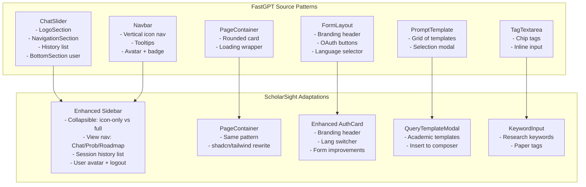
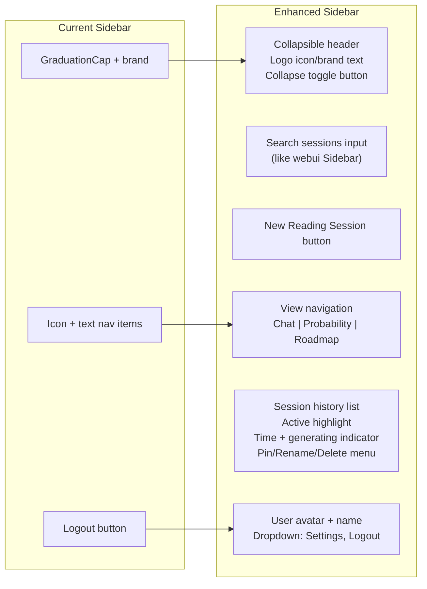
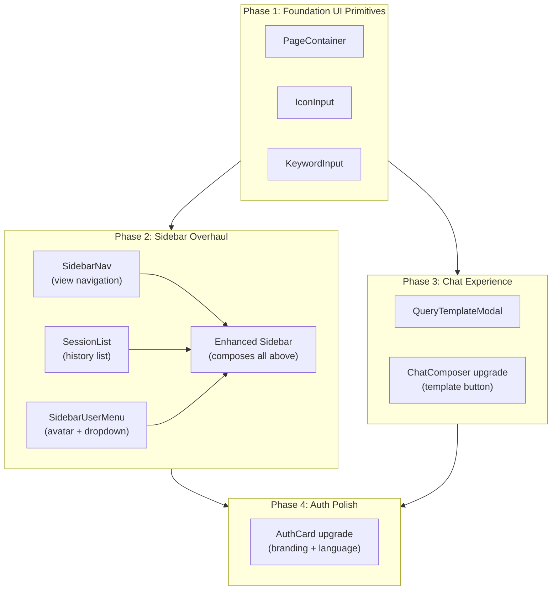

# FastGPT → ScholarSight UI Adaptation Plan

## Component Mapping & Adaptation Strategy

---

## 0. Executive Summary

This plan maps **7 core UI patterns** from FastGPT into ScholarSight's existing frontend, adapting them to:
- **Tech stack**: React 18 + Vite + Tailwind CSS + shadcn/ui (NOT Chakra UI / Next.js)
- **State management**: React Context providers + custom hooks (NOT FastGPT's Zustand stores)
- **Domain context**: Academic research assistant (NOT AI chatbot platform)
- **Styling**: CSS variables + `cn()` helper + Tailwind classes (NOT Chakra `sx` props / `useTheme()`)

Each FastGPT component will be **stripped of business logic**, **re-rendered with shadcn/ui primitives**, and **wired into ScholarSight's existing providers and hooks**.

---

## 1. Component Mapping Table

| # | FastGPT Component | ScholarSight Adaptation | Key Changes |
|---|---|---|---|
| **1** | `ChatSlider` (sidebar with collapse animation, logo, nav, history list, user menu) | **Enhanced `Sidebar`** — collapsible nav with icon+text view, session history list, user avatar popover, new-session button | Replace Chakra `Flex/MotionFlex` with Tailwind classes + framer-motion; replace FastGPT icon system with Lucide React icons; wire to `useAuth` + `useChat` |
| **2** | `ChatSliderList` (history list with pin/edit/delete, active highlight, generating indicator) | **`SessionList`** — chat history list within sidebar showing reading sessions, active highlight, timestamp | Replace `useContextSelector` with React Context; use `formatTimeToChatTime` → `format.ts`'s `relativeTime`; shadcn `DropdownMenu` for pin/rename/delete |
| **3** | `Navbar` (vertical icon nav with tooltips, avatar, badge count) | **`SidebarNav`** — vertical icon navigation integrated into collapsed sidebar state | Adapt the icon-only nav pattern for Chat / Probability / Roadmap / Settings; use Lucide icons; add tooltips via shadcn Tooltip |
| **4** | `PageContainer` (bordered card container with loading state) | **`PageContainer`** — reusable wrapper for probability/roadmap/settings views with consistent border-radius + shadow | Simple adaptation: `@chakra-ui` Box → Tailwind `div` with `rounded-2xl border shadow-sm` |
| **5** | `FormLayout` (login form wrapper with OAuth, language switcher, branding) | **Enhanced `LoginForm` / `AuthCard`** — improved form layout with social login placeholder, language selector, branding header | Adapt the centered card + branding header pattern; keep existing auth logic; add language switcher from existing `LanguageSwitcher` |
| **6** | `PromptTemplate` (modal grid of template cards with selection) | **`QueryTemplateModal`** — modal showing pre-built academic query templates (e.g., "Analyze this paper", "Compare methodologies") | Replace template data; use shadcn `Dialog` + `Card` grid; wire to `ChatComposer` for template insertion |
| **7** | `TagTextarea` (inline tag input with chips + free-text) | **`KeywordInput`** — tag-style input for research keywords/topics | Adapt the chip + inline input pattern using Tailwind; use for probability assessment keywords or paper tagging |

---

## 2. Architecture Flow



---

## 3. Detailed Component-Level Plans

### 3.1 Enhanced Sidebar (`Sidebar` rewrite)

**Source**: FastGPT's [`ChatSlider`](FastGPT-reference/pageComponents/chat/slider/index.tsx) + [`Navbar`](FastGPT-reference/components/Layout/navbar.tsx)

**Current ScholarSight**: [`Sidebar.tsx`](frontend/src/components/layout/Sidebar.tsx) — basic `div` with Lucide icons, no collapse animation, no session history, no user avatar.

**Adaptation Plan**:



**Key Implementation Details**:
- Use `framer-motion` for collapse/expand animation (same as FastGPT's `MotionBox`/`AnimatePresence`)
- Two states: `expanded` (272px, icons + text) and `collapsed` (64px, icons only with tooltips)
- Collapse state persisted to `localStorage` (already done in `App.tsx`)
- Session history: new `useSessions` hook OR extend `useChat` to track session list
- View navigation: adapt FastGPT's `NavigationSection` pattern — icon buttons that highlight when active
- User section: adapt FastGPT's `BottomSection` — avatar + name + dropdown menu

**Files to create/modify**:
- `MODIFY` [`frontend/src/components/layout/Sidebar.tsx`](frontend/src/components/layout/Sidebar.tsx) — full rewrite
- `NEW` [`frontend/src/components/layout/SessionList.tsx`](frontend/src/components/layout/SessionList.tsx) — adapted from `ChatSliderList`
- `NEW` [`frontend/src/components/layout/SidebarUserMenu.tsx`](frontend/src/components/layout/SidebarUserMenu.tsx) — adapted from FastGPT `BottomSection`
- `NEW` [`frontend/src/components/layout/SidebarNav.tsx`](frontend/src/components/layout/SidebarNav.tsx) — adapted from FastGPT `NavigationSection`

---

### 3.2 Session List Component

**Source**: FastGPT's [`ChatSliderList`](FastGPT-reference/pageComponents/chat/slider/ChatSliderList.tsx) (lines 16-236)

**Adaptation**:
- Replace `useContextSelector(ChatContext, ...)` → props from parent `Sidebar`
- Replace `ChatGenerateStatusEnum` → `"generating" | "idle"` string states
- Replace FastGPT `MyMenu` → shadcn `DropdownMenu` with items: Pin/Unpin, Rename, Delete
- Replace `formatTimeToChatTime` → `relativeTime` from [`format.ts`](frontend/src/lib/format.ts)
- Replace Chakra `Flex/Box/IconButton` → Tailwind `div/button` classes
- Keep the hover-reveal pattern (time hidden, menu shown on hover)
- Keep the active highlight pattern (`primary.50` bg → `bg-primary/10` Tailwind)
- Keep the unread dot indicator

**Contextualization**:
- "New Chat" → "New Reading Session"
- "Pin" → "Pin Session"
- "Custom History Title" → "Rename Session"
- History items represent reading/research sessions, not chat conversations

---

### 3.3 Page Container

**Source**: FastGPT's [`PageContainer`](FastGPT-reference/components/PageContainer/index.tsx) (lines 1-31)

**Adaptation**: Nearly a direct 1:1 port but replacing Chakra with Tailwind:
```tsx
// FastGPT (Chakra):
<MyBox h="100%" py={[0, '16px']} pr={[0, '16px']}>
  <MyBox isLoading={isLoading} borderColor="borderColor.base" 
    borderWidth={[0, 1]} boxShadow="1.5" bg="myGray.25" 
    borderRadius={[0, '16px']} overflowX="hidden">
    {children}
  </MyBox>
</MyBox>

// ScholarSight (Tailwind):
<div className="h-full py-0 md:py-4 pr-0 md:pr-4">
  <div className="h-full rounded-none md:rounded-2xl border-0 md:border 
    shadow-sm bg-card overflow-x-hidden">
    {children}
  </div>
</div>
```

**File**: `NEW` [`frontend/src/components/ui/page-container.tsx`](frontend/src/components/ui/page-container.tsx)

---

### 3.4 Enhanced Auth Forms

**Source**: FastGPT's [`FormLayout`](FastGPT-reference/pageComponents/login/LoginForm/FormLayout.tsx) + [`LoginContainer`](FastGPT-reference/pageComponents/login/index.tsx)

**Current ScholarSight**: [`AuthCard.tsx`](frontend/src/components/landing/AuthCard.tsx) — basic email/password form with login/register toggle.

**Adaptation Plan**:
- Add branding header with icon + app name (adapt FastGPT's `FormLayout` header pattern)
- Add language selector to the auth card (adapt FastGPT's `I18nLngSelector` placement)
- Improve form layout with better spacing, labels, and error states (adapt FastGPT's centered `380px` card width)
- Add "or" divider section (placeholder for future social login)
- Keep existing login/register logic from `AuthProvider`

**File**: `MODIFY` [`frontend/src/components/landing/AuthCard.tsx`](frontend/src/components/landing/AuthCard.tsx)

---

### 3.5 Query Template Modal

**Source**: FastGPT's [`PromptTemplate`](FastGPT-reference/components/PromptTemplate/index.tsx) (lines 1-66)

**Adaptation**:
- Replace FastGPT `MyModal` → shadcn `Dialog`
- Replace Chakra `Grid/Box` → Tailwind grid
- Replace FastGPT prompt templates → Academic query templates:
  - "Summarize Paper" — "Provide a structured summary of this paper"
  - "Analyze Methodology" — "Critically analyze the research methodology used"
  - "Compare Papers" — "Compare and contrast the approaches in these papers"
  - "Extract Key Findings" — "List the key findings and contributions"
  - "Identify Limitations" — "What are the limitations acknowledged by the authors?"
  - "Generate Citations" — "Format citations in APA/MLA/Chicago style"
  - "Literature Review" — "Help me synthesize findings across related works"
  - "Future Work" — "Suggest potential future research directions"

**File**: `NEW` [`frontend/src/components/chat/QueryTemplateModal.tsx`](frontend/src/components/chat/QueryTemplateModal.tsx)

**Integration**: The modal is triggered from a "Templates" button in `ChatComposer`. On selection, the template text is inserted into the composer input.

---

### 3.6 Keyword Input (Tag Input)

**Source**: FastGPT's [`TagTextarea`](FastGPT-reference/components/common/Textarea/TagTextarea.tsx) (lines 1-101)

**Adaptation**:
- Replace Chakra `Tag/TagCloseButton/TagLabel` → Tailwind-styled chip components
- Replace `useToast` → shadcn `toast` or inline error message
- Use case: research topic keywords, paper tags, or probability assessment criteria
- Keep the inline input + chip pattern
- Add keyboard navigation (Enter to add, Backspace to remove last)

**File**: `NEW` [`frontend/src/components/ui/keyword-input.tsx`](frontend/src/components/ui/keyword-input.tsx)

---

### 3.7 MyInput (Icon Input)

**Source**: FastGPT's [`MyInput`](FastGPT-reference/components/MyInput/index.tsx) (lines 1-35)

**Adaptation**: A simple icon-input wrapper using Tailwind:
```tsx
<div className="relative flex items-center">
  {leftIcon && <span className="absolute left-3 z-10">{leftIcon}</span>}
  <input className={cn("w-full", leftIcon && "pl-9", rightIcon && "pr-9")} />
  {rightIcon && <span className="absolute right-3 z-10">{rightIcon}</span>}
</div>
```

**File**: `NEW` [`frontend/src/components/ui/icon-input.tsx`](frontend/src/components/ui/icon-input.tsx)

---

## 4. Implementation Order (Dependency Graph)



---

## 5. Design Token Mapping (Chakra → Tailwind CSS)

| FastGPT (Chakra) | ScholarSight (Tailwind/shadcn) |
|---|---|
| `bg="myGray.100"` | `bg-muted` |
| `bg="myGray.25"` | `bg-card` |
| `bg="myGray.50"` | `bg-muted/50` |
| `bg="white"` | `bg-background` |
| `bg="primary.50"` | `bg-primary/10` |
| `bg="primary.100"` | `bg-primary/15` |
| `color="primary.600"` | `text-primary` |
| `color="primary.700"` | `text-primary font-medium` |
| `color="myGray.400"` | `text-muted-foreground/70` |
| `color="myGray.500"` | `text-muted-foreground` |
| `color="myGray.900"` | `text-foreground` |
| `border={theme.borders.base}` | `border border-border` |
| `boxShadow="1.5"` | `shadow-sm` |
| `borderRadius="md"` | `rounded-md` (or `rounded-lg`) |
| `borderRadius="16px"` | `rounded-2xl` |
| `fontSize="sm"` | `text-sm` |
| `fontSize="mini"` | `text-xs` |
| `fontSize="xs"` | `text-xs` |

---

## 6. Icon Mapping (FastGPT Custom Icons → Lucide React)

| FastGPT Icon Name | Lucide Equivalent |
|---|---|
| `navbar/chatLight` / `navbar/chatFill` | `MessageSquare` |
| `navbar/dashboardLight` / `navbar/dashboardFill` | `BarChart3` |
| `navbar/datasetLight` / `navbar/datasetFill` | `FolderOpen` or `Library` |
| `navbar/userLight` / `navbar/userFill` | `User` |
| `core/chat/sidebar/fold` | `PanelLeftClose` |
| `core/chat/sidebar/expand` | `PanelLeftOpen` |
| `core/chat/sidebar/home` | `Home` |
| `core/chat/sidebar/star` | `Star` |
| `common/app` | `AppWindow` or `Grid3X3` |
| `common/setting` | `Settings` |
| `common/gitInlight` | `Github` (from simple-icons or custom) |
| `core/chat/chatLight` / `core/chat/chatFill` | `MessageSquare` (filled variant via CSS) |
| `core/chat/setTopLight` | `Pin` |
| `common/customTitleLight` | `Pencil` |
| `delete` | `Trash2` |
| `more` | `MoreHorizontal` |
| `support/user/informLight` | `Bell` |

---

## 7. State Management Integration

All adapted components will connect to ScholarSight's existing state:

| Component | State Source | Notes |
|---|---|---|
| Enhanced Sidebar | `useAuth` (user), `useChat` (messages/sessions) | Sidebar reads user from AuthProvider; session list from new `useSessions` hook |
| SessionList | `useChat` (extended with session management) | Need to add: `sessions[]`, `activeSessionId`, `createSession`, `deleteSession`, `renameSession` |
| SidebarUserMenu | `useAuth` (user, logout) | Already available |
| QueryTemplateModal | Local state (open/close) + `ChatComposer` callback | Template insert triggers `setInput` in composer |
| AuthCard | `useAuth` (login, register) + local form state | Already wired |
| KeywordInput | Local state + parent callback | Generic controlled component |

---

## 8. I18n Key Additions

New translation keys needed in [`common.json`](frontend/src/i18n/locales/en/common.json):

```json
{
  "sidebar": {
    "collapse": "Collapse sidebar",
    "expand": "Expand sidebar",
    "newSession": "New Reading Session",
    "searchSessions": "Search sessions...",
    "noSessions": "No reading sessions yet",
    "recentSessions": "Recent Sessions",
    "pinSession": "Pin Session",
    "unpinSession": "Unpin Session",
    "renameSession": "Rename Session",
    "deleteSession": "Delete Session",
    "renameTitle": "Session Name",
    "renamePlaceholder": "Enter session name..."
  },
  "templates": {
    "title": "Query Templates",
    "summarize": "Summarize Paper",
    "summarizeDesc": "Provide a structured summary of this paper",
    "methodology": "Analyze Methodology",
    "methodologyDesc": "Critically analyze the research methodology used",
    "compare": "Compare Papers",
    "compareDesc": "Compare and contrast the approaches in these papers",
    "findings": "Extract Key Findings",
    "findingsDesc": "List the key findings and contributions",
    "limitations": "Identify Limitations",
    "limitationsDesc": "What are the limitations acknowledged by the authors?",
    "citations": "Generate Citations",
    "citationsDesc": "Format citations in APA/MLA/Chicago style",
    "literature": "Literature Review",
    "literatureDesc": "Help me synthesize findings across related works",
    "future": "Future Work",
    "futureDesc": "Suggest potential future research directions",
    "useTemplate": "Use Template"
  },
  "keyword": {
    "placeholder": "Type keyword and press Enter...",
    "duplicate": "Keyword already added"
  },
  "session": {
    "generating": "Generating...",
    "newSession": "New Reading Session"
  }
}
```

---

## 9. Files Changed Summary

### New Files (7)
| File | Source Pattern |
|---|---|
| [`frontend/src/components/ui/page-container.tsx`](frontend/src/components/ui/page-container.tsx) | FastGPT `PageContainer` |
| [`frontend/src/components/ui/icon-input.tsx`](frontend/src/components/ui/icon-input.tsx) | FastGPT `MyInput` |
| [`frontend/src/components/ui/keyword-input.tsx`](frontend/src/components/ui/keyword-input.tsx) | FastGPT `TagTextarea` |
| [`frontend/src/components/layout/SessionList.tsx`](frontend/src/components/layout/SessionList.tsx) | FastGPT `ChatSliderList` |
| [`frontend/src/components/layout/SidebarUserMenu.tsx`](frontend/src/components/layout/SidebarUserMenu.tsx) | FastGPT `BottomSection` |
| [`frontend/src/components/layout/SidebarNav.tsx`](frontend/src/components/layout/SidebarNav.tsx) | FastGPT `NavigationSection` |
| [`frontend/src/components/chat/QueryTemplateModal.tsx`](frontend/src/components/chat/QueryTemplateModal.tsx) | FastGPT `PromptTemplate` |

### Modified Files (3)
| File | Changes |
|---|---|
| [`frontend/src/components/layout/Sidebar.tsx`](frontend/src/components/layout/Sidebar.tsx) | Full rewrite with collapse animation, session list, user menu |
| [`frontend/src/components/landing/AuthCard.tsx`](frontend/src/components/landing/AuthCard.tsx) | Add branding header, language selector, improved form layout |
| [`frontend/src/components/chat/ChatComposer.tsx`](frontend/src/components/chat/ChatComposer.tsx) | Add template button → opens QueryTemplateModal |

### New Dependencies
- `framer-motion` — for sidebar collapse/expand animations (already used in FastGPT ChatSlider)
- No other new dependencies needed

---

## 10. What We Are NOT Taking from FastGPT

| FastGPT Component | Reason to Skip |
|---|---|
| `Layout/index.tsx` (auth wrapper, model checks, notifications) | ScholarSight already has `AuthProvider` + `App.tsx` boot state machine |
| `HelperBot.tsx` | FastGPT-specific support chatbot |
| `NotSufficientModal`, wallet components | FastGPT billing/pricing — not applicable |
| `MemberManager`, dataset detail pages | Requires FastGPT's dataset backend — ScholarSight has different document model |
| `ToolRow`, workflow components | FastGPT's workflow/agent system — not in ScholarSight scope |
| `LoginForm.tsx` (full, with OAuth) | ScholarSight has simpler email/password auth; OAuth placeholder only |
| `RegisterForm.tsx` (full) | ScholarSight has working registration already |
| `WechatForm.tsx` | Platform-specific (WeChat) |
| `ChatSliderHeader`, `ChatSliderMenu` | Over-abstracted for ScholarSight's needs; simpler inline approach |
| Checkbox/Radio/Switch form components | ScholarSight doesn't need these yet |
| `QRCodePayModal`, `StandardPlanContentList` | FastGPT billing |