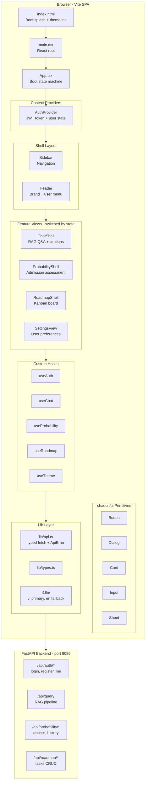
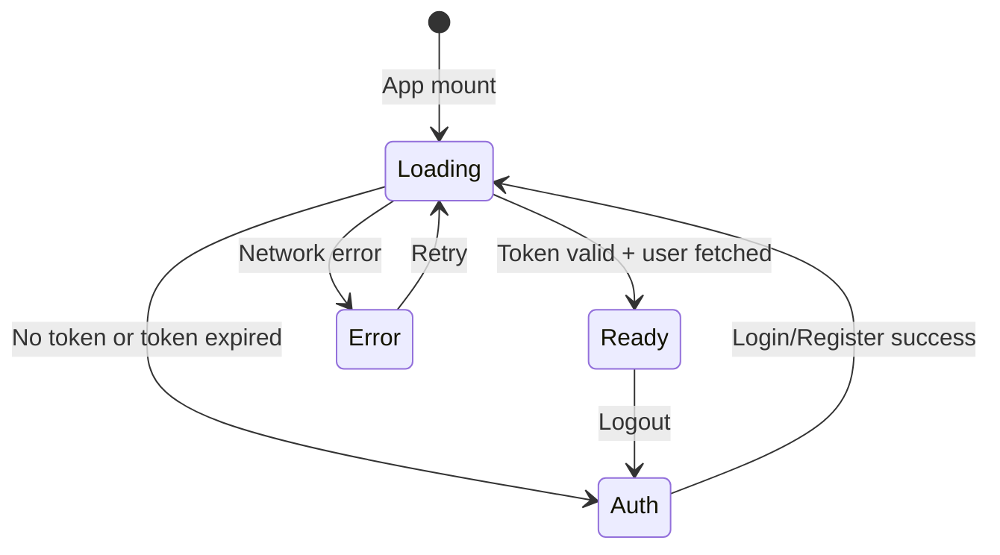

# ScholarSight Frontend Migration Plan

## Full Rewrite: Next.js → Vite SPA (nanobot webui patterns)

---

## 1. Executive Summary

Replace the existing Next.js frontend with a new Vite-based SPA that adopts the nanobot webui's architecture, component patterns, design system, and best practices — while preserving ScholarSight's unique academic identity: RAG-powered chat with citations, admission probability engine, and personalized Kanban roadmap.

### Key Decisions

| Decision | Choice | Rationale |
|----------|--------|-----------|
| Framework | Vite + React 18 SPA | Matches nanobot reference; simpler deployment; no SSR needed |
| Styling | shadcn/ui New York + CSS variables | Full design token system with light/dark mode |
| API layer | REST via typed `fetch` wrapper | Backend is REST-only; nanobot `ApiError` + `request<T>` pattern |
| i18n | i18next with `vi` as primary, `en` as fallback | Vietnamese academic market; nanobot i18n infrastructure |
| Testing | Vitest + happy-dom + Testing Library | Matches nanobot reference exactly |
| State | React Context providers + custom hooks | No Redux; follows nanobot `ClientProvider` pattern |
| Routing | Client-side via view state | SPA shell with view switching, like nanobot |

---

## 2. Architecture Comparison

### Current Frontend (to be replaced)

```
frontend/
├── app/                    # Next.js App Router pages
│   ├── layout.tsx          # Root layout with AuthProvider
│   ├── page.tsx            # Landing page
│   ├── auth/login/         # Login page
│   ├── auth/register/      # Register page
│   ├── chat/page.tsx       # RAG Q&A chat
│   ├── probability/page.tsx # Probability engine form
│   ├── roadmap/page.tsx    # Kanban board
│   └── admin/page.tsx      # Admin panel
├── components/
│   └── auth-provider.tsx   # JWT auth context
├── lib/
│   ├── api.ts              # Axios instance with interceptor
│   └── auth.ts             # Token helpers
└── package.json            # Next.js 16, React 18, axios, recharts
```

### Target Architecture (new)

```
frontend/
├── index.html              # Vite entry with boot splash + theme script
├── vite.config.ts          # Vite config with API proxy
├── tailwind.config.js      # shadcn/ui New York design tokens
├── tsconfig.json           # Vite-compatible TS config
├── tsconfig.build.json     # Build-only config excluding tests
├── components.json         # shadcn/ui configuration
├── postcss.config.js
├── package.json
├── public/
│   └── brand/              # ScholarSight favicon, logos
├── src/
│   ├── main.tsx            # React root + crypto.randomUUID shim
│   ├── App.tsx             # Boot state machine + Shell layout
│   ├── globals.css         # Design tokens (light/dark), utility classes
│   ├── components/
│   │   ├── ui/             # shadcn/ui primitives (copied from webui)
│   │   │   ├── alert-dialog.tsx
│   │   │   ├── avatar.tsx
│   │   │   ├── button.tsx
│   │   │   ├── dialog.tsx
│   │   │   ├── dropdown-menu.tsx
│   │   │   ├── input.tsx
│   │   │   ├── scroll-area.tsx
│   │   │   ├── select.tsx      # NEW: for university/method dropdowns
│   │   │   ├── separator.tsx
│   │   │   ├── sheet.tsx
│   │   │   ├── tabs.tsx        # NEW: for roadmap/probability views
│   │   │   ├── textarea.tsx
│   │   │   ├── tooltip.tsx
│   │   │   ├── card.tsx        # NEW: for feature cards, results
│   │   │   ├── badge.tsx       # NEW: for tier/status badges
│   │   │   ├── label.tsx       # NEW: for form labels
│   │   │   └── progress.tsx    # NEW: for probability gauge
│   │   ├── layout/         # App shell components
│   │   │   ├── Sidebar.tsx     # Navigation sidebar (adapted from webui)
│   │   │   ├── Header.tsx      # Top header per view
│   │   │   └── NavItem.tsx     # Sidebar navigation item
│   │   ├── auth/           # Authentication UI
│   │   │   ├── LoginForm.tsx
│   │   │   ├── RegisterForm.tsx
│   │   │   └── AuthGuard.tsx   # Route protection wrapper
│   │   ├── chat/           # RAG Q&A feature
│   │   │   ├── ChatShell.tsx       # Chat view container
│   │   │   ├── ChatComposer.tsx    # Message input (adapted ThreadComposer)
│   │   │   ├── ChatMessages.tsx    # Message list (adapted ThreadMessages)
│   │   │   ├── MessageBubble.tsx   # Single message (adapted from webui)
│   │   │   ├── CitationChip.tsx    # Source citation badge
│   │   │   ├── CitationModal.tsx   # Citation detail dialog
│   │   │   ├── EmptyState.tsx      # Empty chat placeholder
│   │   │   └── MarkdownText.tsx    # Markdown renderer (from webui)
│   │   ├── probability/    # Admission probability engine
│   │   │   ├── ProbabilityShell.tsx    # Assessment view container
│   │   │   ├── AssessmentForm.tsx      # Score/university/major input
│   │   │   ├── TierBadge.tsx           # Safety/Target/Reach indicator
│   │   │   ├── CompetitiveMap.tsx      # Score distribution chart
│   │   │   ├── HistoricalChart.tsx     # Year-over-year cutoffs
│   │   │   └── AssessmentHistory.tsx   # Past assessments list
│   │   ├── roadmap/        # Kanban roadmap feature
│   │   │   ├── RoadmapShell.tsx    # Roadmap view container
│   │   │   ├── KanbanBoard.tsx     # Three-column board
│   │   │   ├── KanbanColumn.tsx    # Single column (todo/progress/done)
│   │   │   ├── TaskCard.tsx        # Draggable task card
│   │   │   ├── TaskCreateDialog.tsx # New task form
│   │   │   ├── MonthFilter.tsx     # Month pill filter bar
│   │   │   └── SuggestButton.tsx   # AI suggestion trigger
│   │   ├── settings/       # User settings
│   │   │   └── SettingsView.tsx
│   │   ├── DeleteConfirm.tsx   # Reusable delete confirmation
│   │   ├── CodeBlock.tsx       # Syntax-highlighted code
│   │   └── LanguageSwitcher.tsx
│   ├── hooks/
│   │   ├── useAuth.ts          # JWT auth state + login/register/logout
│   │   ├── useChat.ts          # RAG chat state (send, messages, loading)
│   │   ├── useProbability.ts   # Probability assessment state
│   │   ├── useRoadmap.ts       # Roadmap tasks CRUD state
│   │   └── useTheme.ts        # Light/dark theme (from webui)
│   ├── providers/
│   │   └── AuthProvider.tsx    # Auth context (analogous to ClientProvider)
│   ├── lib/
│   │   ├── api.ts          # Typed fetch wrapper: request<T>, ApiError
│   │   ├── types.ts        # All TypeScript interfaces
│   │   ├── utils.ts        # cn() helper
│   │   └── format.ts       # Date/title formatting
│   ├── i18n/
│   │   ├── config.ts       # Locale detection, storage, normalization
│   │   ├── index.ts        # i18next initialization
│   │   └── locales/
│   │       ├── vi/common.json  # PRIMARY: Vietnamese
│   │       └── en/common.json  # FALLBACK: English
│   └── tests/
│       ├── setup.ts        # Vitest setup
│       ├── api.test.ts
│       ├── auth.test.tsx
│       ├── chat.test.tsx
│       └── roadmap.test.tsx
```

---

## 3. Architecture Diagram



---

## 4. File-by-File Migration Map

### 4.1 Direct Copies from webui (adapt namespace only)

| webui source | frontend target | Changes |
|---|---|---|
| `src/lib/utils.ts` | `src/lib/utils.ts` | None — `cn()` helper identical |
| `src/hooks/useTheme.ts` | `src/hooks/useTheme.ts` | Change storage key to `scholarsight.theme` |
| `src/components/ui/*` | `src/components/ui/*` | Copy all 11 primitives verbatim |
| `src/components/DeleteConfirm.tsx` | `src/components/DeleteConfirm.tsx` | None |
| `src/components/CodeBlock.tsx` | `src/components/CodeBlock.tsx` | None |
| `src/components/MarkdownText.tsx` | `src/components/chat/MarkdownText.tsx` | None |
| `src/components/MarkdownTextRenderer.tsx` | `src/components/chat/MarkdownTextRenderer.tsx` | None |
| `src/components/LanguageSwitcher.tsx` | `src/components/LanguageSwitcher.tsx` | None |

### 4.2 Adapted from webui (significant modifications)

| webui source | frontend target | Adaptation |
|---|---|---|
| `src/App.tsx` | `src/App.tsx` | Replace nanobot WS boot with JWT auth boot; add view routing for chat/probability/roadmap/settings |
| `src/main.tsx` | `src/main.tsx` | Change branding; keep `crypto.randomUUID` shim |
| `src/providers/ClientProvider.tsx` | `src/providers/AuthProvider.tsx` | Replace `NanobotClient` with JWT `user` + `token`; expose `login`, `register`, `logout` |
| `src/lib/api.ts` | `src/lib/api.ts` | Replace nanobot session/settings APIs with ScholarSight endpoints: auth, query, probability, roadmap |
| `src/lib/types.ts` | `src/lib/types.ts` | Replace nanobot types with ScholarSight domain types |
| `src/hooks/useSessions.ts` | `src/hooks/useChat.ts` | Replace session list with chat message management; REST POST to `/api/query` |
| `src/components/Sidebar.tsx` | `src/components/layout/Sidebar.tsx` | Replace chat list with nav items: Chat, Probability, Roadmap; keep collapse/mobile patterns |
| `src/components/thread/ThreadShell.tsx` | `src/components/chat/ChatShell.tsx` | Adapt for REST-based Q&A instead of WebSocket streaming |
| `src/components/thread/ThreadComposer.tsx` | `src/components/chat/ChatComposer.tsx` | Simplified: text input only, no image attachments |
| `src/components/thread/ThreadMessages.tsx` | `src/components/chat/ChatMessages.tsx` | Add citation rendering; remove streaming delta logic |
| `src/components/MessageBubble.tsx` | `src/components/chat/MessageBubble.tsx` | Add citation chips; human fallback indicator |
| `src/components/EmptyState.tsx` | `src/components/chat/EmptyState.tsx` | ScholarSight academic branding |
| `src/lib/format.ts` | `src/lib/format.ts` | Keep `relativeTime`, `fmtDateTime`; remove `deriveTitle` |
| `src/i18n/*` | `src/i18n/*` | Keep config/index structure; replace nanobot translations with ScholarSight academic strings; vi primary |
| `index.html` | `index.html` | ScholarSight branding, favicon, boot copy |
| `tailwind.config.js` | `tailwind.config.js` | Same structure; keep academic-appropriate color tokens |
| `src/globals.css` | `src/globals.css` | Same CSS variable system; same utility classes |
| `vite.config.ts` | `vite.config.ts` | Proxy to `localhost:8086` instead of `8765`; remove WS proxy |

### 4.3 New ScholarSight-Specific Components

| Component | Purpose |
|---|---|
| `src/components/auth/LoginForm.tsx` | Email/password login form using shadcn/ui Input + Button |
| `src/components/auth/RegisterForm.tsx` | Registration with full_name field |
| `src/components/auth/AuthGuard.tsx` | Wraps views requiring auth; redirects to login |
| `src/components/chat/CitationChip.tsx` | Clickable source badge with cosine score |
| `src/components/chat/CitationModal.tsx` | Dialog showing citation summary + image |
| `src/components/probability/ProbabilityShell.tsx` | Assessment view container |
| `src/components/probability/AssessmentForm.tsx` | Score + university + major form using Select + Input |
| `src/components/probability/TierBadge.tsx` | 🟢 An toàn / 🟡 Mục tiêu / 🔴 Thách thức badge |
| `src/components/probability/CompetitiveMap.tsx` | Score distribution visualization |
| `src/components/probability/HistoricalChart.tsx` | Multi-year cutoff chart |
| `src/components/probability/AssessmentHistory.tsx` | Past assessments table |
| `src/components/roadmap/RoadmapShell.tsx` | Roadmap view container |
| `src/components/roadmap/KanbanBoard.tsx` | Three-column drag-and-drop board |
| `src/components/roadmap/KanbanColumn.tsx` | Single status column |
| `src/components/roadmap/TaskCard.tsx` | Task card with month/category badges |
| `src/components/roadmap/TaskCreateDialog.tsx` | New task dialog form |
| `src/components/roadmap/MonthFilter.tsx` | Horizontal month pill filter |
| `src/components/roadmap/SuggestButton.tsx` | AI-powered task suggestion button |
| `src/hooks/useAuth.ts` | Login, register, logout, fetchUser, token management |
| `src/hooks/useChat.ts` | Send query, manage messages, loading state |
| `src/hooks/useProbability.ts` | Assess probability, fetch history |
| `src/hooks/useRoadmap.ts` | Tasks CRUD, reorder, month filter |

---

## 5. API Layer Design

### 5.1 Typed API Client (following nanobot pattern)

```typescript
// src/lib/api.ts — follows webui/src/lib/api.ts pattern exactly

export class ApiError extends Error {
  status: number;
  constructor(status: number, message: string) {
    super(message);
    this.status = status;
    this.name = "ApiError";
  }
}

async function request<T>(
  url: string,
  token: string | null,
  init?: RequestInit,
): Promise<T> {
  const headers: Record<string, string> = {
    "Content-Type": "application/json",
    ...(init?.headers as Record<string, string> ?? {}),
  };
  if (token) headers.Authorization = `Bearer ${token}`;
  
  const res = await fetch(url, {
    ...init,
    headers,
    credentials: "same-origin",
  });
  if (!res.ok) throw new ApiError(res.status, `HTTP ${res.status}`);
  if (res.status === 204) return undefined as T;
  return (await res.json()) as T;
}

// Auth
export async function login(email: string, password: string, base = ""): Promise<TokenResponse> { ... }
export async function register(email: string, password: string, fullName: string, base = ""): Promise<TokenResponse> { ... }
export async function fetchMe(token: string, base = ""): Promise<UserResponse> { ... }

// Query (RAG chat)
export async function submitQuery(token: string, query: string, base = ""): Promise<QueryResponse> { ... }

// Probability
export async function assessProbability(token: string, body: ProbabilityRequest, base = ""): Promise<ProbabilityResponse> { ... }
export async function fetchAssessmentHistory(token: string, base = ""): Promise<AssessmentHistoryItem[]> { ... }

// Roadmap
export async function listTasks(token: string, params?: TaskFilter, base = ""): Promise<TaskResponse[]> { ... }
export async function createTask(token: string, body: TaskCreate, base = ""): Promise<TaskResponse> { ... }
export async function updateTask(token: string, id: string, body: TaskUpdate, base = ""): Promise<TaskResponse> { ... }
export async function deleteTask(token: string, id: string, base = ""): Promise<void> { ... }
export async function reorderTasks(token: string, items: ReorderItem[], base = ""): Promise<void> { ... }
export async function suggestTasks(token: string, body: SuggestRequest, base = ""): Promise<SuggestionResponse> { ... }
```

### 5.2 Type Definitions

```typescript
// src/lib/types.ts — ScholarSight domain types

// Auth
export interface TokenResponse { access_token: string; token_type: string; }
export interface UserResponse { id: string; email: string; full_name: string; role: string; }

// Chat / Query
export interface QueryRequest { query: string; top_k?: number; threshold?: number; }
export interface SourceCitation { doc_id: string; component_type: string; summary: string; image_url: string | null; cosine_score: number; }
export interface QueryResponse { answer: string; disclaimer: string; citations: SourceCitation[]; human_fallback: boolean; fallback_reason: string | null; }
export interface ChatMessage { id: string; role: "user" | "assistant"; content: string; citations?: SourceCitation[]; humanFallback?: boolean; createdAt: number; }

// Probability
export interface ProbabilityRequest { score: number; university: string; major: string; admission_method: string; }
export interface TierResult { tier: string; emoji: string; label: string; percentile_rank: number; }
export interface CompetitiveMapData { candidate_score: number; cutoff_score: number; score_distribution: Record<string, number>; tier_boundaries: Record<string, number>; historical_years: Array<{ year: number; cutoff_score: number }>; }
export interface ProbabilityResponse { tier: TierResult; competitive_map: CompetitiveMapData; disclaimer: string; }
export interface AssessmentHistoryItem { id: string; university: string; major: string; score: number; tier: string; percentile_rank: number; created_at: string | null; }

// Roadmap
export type TaskStatus = "todo" | "in_progress" | "done";
export interface TaskResponse { id: string; title: string; description: string | null; status: TaskStatus; due_month: number | null; category: string | null; sort_order: number | null; created_at: string | null; }
export interface TaskCreate { title: string; description?: string; status?: TaskStatus; due_month?: number; category?: string; sort_order?: number; }
export interface TaskUpdate { title?: string; description?: string; status?: TaskStatus; due_month?: number; category?: string; sort_order?: number; }
export interface TaskFilter { month?: number; category?: string; status?: TaskStatus; }
export interface ReorderItem { task_id: string; sort_order: number; }
export interface SuggestRequest { grade?: string; target_universities?: string[]; current_month?: number; }
```

---

## 6. View Routing

The app uses **view state** (not URL routing) like the nanobot webui. A simple state machine in the Shell:

```typescript
type AppView = "chat" | "probability" | "roadmap" | "settings";
const [view, setView] = useState<AppView>("chat");
```

The Sidebar renders navigation items that call `setView()`. Each view is rendered conditionally in the main area. This matches the nanobot pattern where the Shell toggles between `"chat"` and `"settings"`.

---

## 7. Boot State Machine

Following nanobot's `App.tsx` pattern:



```typescript
type BootState =
  | { status: "loading" }
  | { status: "error"; message: string }
  | { status: "auth"; mode: "login" | "register"; failed?: boolean }
  | { status: "ready"; user: UserResponse; token: string };
```

---

## 8. i18n Strategy

- **Primary locale**: `vi` (Vietnamese — target market)
- **Fallback locale**: `en` (English)
- **Structure**: Same as nanobot (`src/i18n/config.ts`, `src/i18n/index.ts`, `src/i18n/locales/{vi,en}/common.json`)
- **Locale detection**: `localStorage` → `navigator.language` → `vi` default
- **Translation keys**: ScholarSight-specific academic terminology

---

## 9. Design System

### CSS Variables (adapted from nanobot globals.css)

Keep the exact same CSS variable structure from the nanobot webui for full shadcn/ui compatibility:
- Light/dark mode via `.dark` class on `<html>`
- `--background`, `--foreground`, `--primary`, `--secondary`, `--muted`, `--accent`, `--destructive`, `--border`, `--input`, `--ring`, `--sidebar-*`
- `--radius` for border radius tokens
- Custom utilities: `shadow-inner-right`, `scrollbar-thin`, `markdown-content`

### Academic-Specific Additions

- Tier colors: `--tier-safety` (green), `--tier-target` (amber), `--tier-reach` (red)
- Kanban column colors via CSS variables

---

## 10. Dependencies

### package.json (new)

```json
{
  "name": "scholarsight-frontend",
  "private": true,
  "version": "0.1.0",
  "type": "module",
  "scripts": {
    "dev": "vite",
    "build": "tsc -p tsconfig.build.json && vite build",
    "preview": "vite preview",
    "test": "vitest run",
    "test:watch": "vitest",
    "lint": "eslint src --max-warnings 0"
  },
  "dependencies": {
    "@radix-ui/react-alert-dialog": "^1.1.4",
    "@radix-ui/react-avatar": "^1.1.2",
    "@radix-ui/react-dialog": "^1.1.4",
    "@radix-ui/react-dropdown-menu": "^2.1.4",
    "@radix-ui/react-scroll-area": "^1.2.2",
    "@radix-ui/react-select": "^2.1.4",
    "@radix-ui/react-separator": "^1.1.1",
    "@radix-ui/react-slot": "^1.1.1",
    "@radix-ui/react-tabs": "^1.1.1",
    "@radix-ui/react-tooltip": "^1.1.6",
    "class-variance-authority": "^0.7.1",
    "clsx": "^2.1.1",
    "i18next": "^26.0.6",
    "lucide-react": "^0.469.0",
    "react": "^18.3.1",
    "react-dom": "^18.3.1",
    "react-i18next": "^17.0.4",
    "react-markdown": "^9.0.1",
    "react-syntax-highlighter": "^15.6.1",
    "recharts": "^2.12.0",
    "rehype-katex": "^7.0.1",
    "remark-gfm": "^4.0.0",
    "remark-math": "^6.0.0",
    "tailwind-merge": "^2.6.0"
  },
  "devDependencies": {
    "@tailwindcss/typography": "^0.5.19",
    "@testing-library/jest-dom": "^6.6.3",
    "@testing-library/react": "^16.1.0",
    "@testing-library/user-event": "^14.5.2",
    "@types/node": "^22.10.5",
    "@types/react": "^18.3.18",
    "@types/react-dom": "^18.3.5",
    "@types/react-syntax-highlighter": "^15.5.13",
    "@vitejs/plugin-react": "^4.3.4",
    "autoprefixer": "^10.4.20",
    "happy-dom": "^16.3.0",
    "katex": "^0.16.21",
    "postcss": "^8.5.0",
    "tailwindcss": "^3.4.17",
    "tailwindcss-animate": "^1.0.7",
    "typescript": "^5.7.2",
    "vite": "^5.4.11",
    "vitest": "^2.1.8"
  }
}
```

### Key Changes from Old frontend/package.json

| Removed | Added | Reason |
|---------|-------|--------|
| `next` | `vite`, `@vitejs/plugin-react` | Framework swap |
| `axios` | — (native `fetch`) | Nanobot pattern: typed fetch wrapper |
| `react-hot-toast` | — (inline toast component) | Lighter; nanobot uses inline toasts |
| `jwt-decode` | — (not needed; `/api/auth/me` validates) | Backend validates tokens |
| `@hello-pangea/dnd` | — (CSS-based drag or future add) | Simplify initial migration |
| — | `i18next`, `react-i18next` | i18n support |
| — | `react-syntax-highlighter` | Code block rendering |
| — | `rehype-katex`, `remark-gfm`, `remark-math` | Rich markdown |
| — | `vitest`, `happy-dom`, `@testing-library/*` | Testing |
| — | `recharts` (kept) | Probability charts |

---

## 11. Docker/Nginx Updates

The `docker/Dockerfile.backend` and nginx configs will need minor updates to serve the Vite build output instead of Next.js:

- **Build**: `cd frontend && npm run build` (output to `frontend/dist/`)
- **Nginx**: Serve `frontend/dist/` as static files with SPA fallback (`try_files $uri /index.html`)
- **Dev proxy**: Vite dev server at port 5173, proxying `/api` to backend at 8086

---

## 12. Implementation Order (Task Breakdown)

### Phase 1: Scaffold & Design System
1. Archive old frontend files (move to `frontend.old/` or git branch)
2. Initialize new Vite project in `frontend/`
3. Configure `vite.config.ts` with API proxy to `:8086`
4. Configure `tsconfig.json` + `tsconfig.build.json`
5. Set up `tailwind.config.js` with shadcn/ui design tokens
6. Create `src/globals.css` with full CSS variable system
7. Create `components.json` for shadcn/ui
8. Create `postcss.config.js`
9. Copy all `src/components/ui/*` primitives from webui
10. Add new shadcn/ui primitives: `select.tsx`, `tabs.tsx`, `card.tsx`, `badge.tsx`, `label.tsx`, `progress.tsx`

### Phase 2: Core Infrastructure
11. Create `src/lib/utils.ts` (cn helper)
12. Create `src/lib/types.ts` (all ScholarSight domain types)
13. Create `src/lib/api.ts` (typed fetch wrapper + all API functions)
14. Create `src/lib/format.ts` (date/title formatting)
15. Create `src/hooks/useTheme.ts` (from webui, key renamed)
16. Set up `src/i18n/config.ts` + `src/i18n/index.ts`
17. Create `src/i18n/locales/vi/common.json` + `src/i18n/locales/en/common.json`

### Phase 3: Auth & App Shell
18. Create `src/providers/AuthProvider.tsx` (JWT context)
19. Create `src/hooks/useAuth.ts` (login, register, logout, fetchUser)
20. Create `index.html` with boot splash + theme/locale scripts
21. Create `src/main.tsx` (React root, crypto shim, i18n import)
22. Create `src/App.tsx` (boot state machine: loading → auth → ready → error)
23. Create `src/components/auth/LoginForm.tsx`
24. Create `src/components/auth/RegisterForm.tsx`
25. Create `src/components/layout/Sidebar.tsx` (navigation: Chat, Probability, Roadmap, Settings)
26. Create `src/components/layout/Header.tsx`

### Phase 4: Chat Feature (RAG Q&A)
27. Create `src/hooks/useChat.ts` (message state, send query, loading)
28. Create `src/components/chat/EmptyState.tsx`
29. Create `src/components/chat/ChatComposer.tsx`
30. Create `src/components/chat/MessageBubble.tsx` (with citation support)
31. Create `src/components/chat/CitationChip.tsx`
32. Create `src/components/chat/CitationModal.tsx`
33. Create `src/components/chat/ChatMessages.tsx`
34. Create `src/components/chat/ChatShell.tsx`
35. Copy + adapt `MarkdownText.tsx` + `MarkdownTextRenderer.tsx` from webui
36. Copy `CodeBlock.tsx` from webui

### Phase 5: Probability Feature
37. Create `src/hooks/useProbability.ts`
38. Create `src/components/probability/AssessmentForm.tsx`
39. Create `src/components/probability/TierBadge.tsx`
40. Create `src/components/probability/CompetitiveMap.tsx`
41. Create `src/components/probability/HistoricalChart.tsx`
42. Create `src/components/probability/AssessmentHistory.tsx`
43. Create `src/components/probability/ProbabilityShell.tsx`

### Phase 6: Roadmap Feature
44. Create `src/hooks/useRoadmap.ts`
45. Create `src/components/roadmap/TaskCard.tsx`
46. Create `src/components/roadmap/KanbanColumn.tsx`
47. Create `src/components/roadmap/KanbanBoard.tsx`
48. Create `src/components/roadmap/TaskCreateDialog.tsx`
49. Create `src/components/roadmap/MonthFilter.tsx`
50. Create `src/components/roadmap/SuggestButton.tsx`
51. Create `src/components/roadmap/RoadmapShell.tsx`

### Phase 7: Settings & Polish
52. Create `src/components/settings/SettingsView.tsx`
53. Create `src/components/LanguageSwitcher.tsx`
54. Create `src/components/DeleteConfirm.tsx`
55. Add light/dark mode toggle to settings/header

### Phase 8: Testing
56. Create `src/tests/setup.ts`
57. Create `src/tests/api.test.ts`
58. Create `src/tests/auth.test.tsx`
59. Create `src/tests/chat.test.tsx`
60. Create `src/tests/roadmap.test.tsx`

### Phase 9: Docker & Deployment
61. Update `docker/Dockerfile.backend` for Vite build
62. Update `docker/nginx/default.conf` for SPA fallback
63. Update `docker/nginx/nginx.prod.conf` for SPA fallback
64. Update `docker/docker-compose.yml` and `docker/docker-compose.prod.yml`
65. Clean up old Next.js files

---

## 13. Risk Mitigation

| Risk | Mitigation |
|---|---|
| Backend API mismatch | Types mirror backend Pydantic models exactly; integration tests |
| Missing shadcn/ui primitives | Add `select`, `tabs`, `card`, `badge`, `label`, `progress` via shadcn CLI or manual copy |
| recharts bundle size | Tree-shake; only import needed chart types |
| No drag-and-drop initially | Roadmap uses button-based move initially; add `@hello-pangea/dnd` in Phase 2 |
| i18n key coverage | Start with Vietnamese primary; English keys can be sparse initially |
