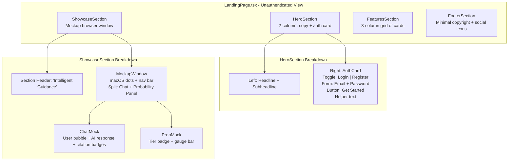
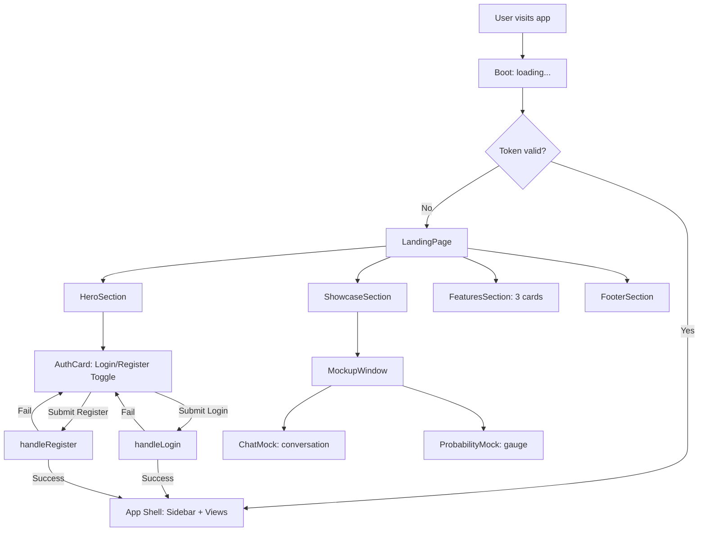

# Landing Page Implementation Plan

## Overview

Replace the current split `LoginForm`/`RegisterForm` auth gate in [`App.tsx`](frontend/src/App.tsx) with a full **landing page** that serves as the unauthenticated view. The landing page matches the spec exactly: Hero 2-column, Middle Showcase (mockup window), Bottom Features 3-grid, Footer.

When the user clicks "Get Started" on the auth card, they slide into the login/register flow (existing components or inline). After auth, the app shell (sidebar + views) is shown — unchanged.

## Architecture Decisions

| Decision | Choice | Rationale |
|---|---|---|
| Where to place | Replace the auth gate in `App.tsx` (lines 123-137) | Single codebase; users see landing before login |
| Component structure | `src/components/landing/` directory with 4 sub-components | Clean separation; matches existing directory conventions |
| Auth flow | Keep existing `LoginForm`/`RegisterForm` but overlay them from the landing page's auth card | Reuse tested auth components; landing card triggers them |
| Mockup window | Pure decorative UI — no interactive functionality | Spec says "do not implement backend logic, just create the beautiful UI" |
| Responsive | Tailwind responsive classes: stack columns on `md:` breakpoint | Premium SaaS aesthetic; mobile-first |

## Component Tree

## File Plan (new + modified files)

### New Files to Create

| File | Purpose |
|---|---|
| [`frontend/src/components/landing/LandingPage.tsx`](frontend/src/components/landing/LandingPage.tsx) | Root landing page: composes all sections in order |
| [`frontend/src/components/landing/HeroSection.tsx`](frontend/src/components/landing/HeroSection.tsx) | Two-column hero: headline left, auth card right |
| [`frontend/src/components/landing/AuthCard.tsx`](frontend/src/components/landing/AuthCard.tsx) | Pill-toggle (Login/Register) + email/password form + submit |
| [`frontend/src/components/landing/ShowcaseSection.tsx`](frontend/src/components/landing/ShowcaseSection.tsx) | Section wrapper with header + MockupWindow |
| [`frontend/src/components/landing/MockupWindow.tsx`](frontend/src/components/landing/MockupWindow.tsx) | macOS-style window chrome with dots + nav bar + body |
| [`frontend/src/components/landing/ChatMock.tsx`](frontend/src/components/landing/ChatMock.tsx) | Mock chat: user message, AI response with citation badges |
| [`frontend/src/components/landing/ProbabilityMock.tsx`](frontend/src/components/landing/ProbabilityMock.tsx) | Mock probability panel: tier badge + competitive gauge |
| [`frontend/src/components/landing/FeaturesSection.tsx`](frontend/src/components/landing/FeaturesSection.tsx) | Section wrapper: headline + 3 feature cards |
| [`frontend/src/components/landing/FeatureCard.tsx`](frontend/src/components/landing/FeatureCard.tsx) | Single feature card with icon, title, description |
| [`frontend/src/components/landing/FooterSection.tsx`](frontend/src/components/landing/FooterSection.tsx) | Minimal footer: copyright + social icon links |

### Modified Files

| File | Change |
|---|---|
| [`frontend/src/App.tsx`](frontend/src/App.tsx) | Replace auth gate (lines 123-137) with `<LandingPage>`; add `onAuthSuccess` callback that triggers login/register; keep existing `LoginForm`/`RegisterForm` as overlay triggered from AuthCard |

---

## Detailed Task Breakdown

### Task 1: Create `LandingPage.tsx` — Root Landing Composer
- Full-width scrollable container (`min-h-screen`, white bg)
- Composes: `<HeroSection>` → `<ShowcaseSection>` → `<FeaturesSection>` → `<FooterSection>`
- Each section separated by generous padding (`py-20` to `py-28`)
- Receives props: `onLogin(email, password)`, `onRegister(email, password, fullName)`

### Task 2: Create `HeroSection.tsx` — Two-Column Hero
- `max-w-7xl mx-auto px-4` centered container
- **Left column** (md:w-1/2):
  - Headline: "Your AI-Powered Path to the Right University" — `text-5xl font-bold tracking-tight`
  - Subheadline: "Accurate Data · Smart Probability · Actionable Roadmaps" — `text-lg text-muted-foreground mt-4`
- **Right column** (md:w-1/2, flex justify-end):
  - Renders `<AuthCard>` component
- Mobile: stacks vertically (left on top, auth card below)

### Task 3: Create `AuthCard.tsx` — Login/Register Toggle Card
- shadcn `Card` with subtle shadow (`shadow-md`)
- **Top**: Two pill-shaped toggle buttons using shadcn `Tabs` (Login | Register)
- **Tab 1 (Login)**: Email `Input` + Password `Input` + `Button` "Get Started" → calls `onLogin`
- **Tab 2 (Register)**: Full Name `Input` + Email `Input` + Password `Input` + `Button` "Get Started" → calls `onRegister`
- **Bottom**: Muted text: "* Trusted by thousands of high school students"
- States: loading (button shows spinner), error (red text above form)

### Task 4: Create `ShowcaseSection.tsx` — Feature Demo Wrapper
- Full-width, slightly off-white bg (`bg-muted/30` or `bg-gray-50`)
- Centered header: "Intelligent Guidance — Answers you can trust" — `text-3xl font-semibold`
- Contains `<MockupWindow>` centered below it

### Task 5: Create `MockupWindow.tsx` — macOS-Style Browser Chrome
- Large rounded container (`rounded-2xl border shadow-xl bg-white`)
- **Chrome bar**: Gray top bar with 3 colored dots (red/yellow/green `w-3 h-3 rounded-full`)
- **Nav bar** (mockup header):
  - **Left**: Brand "AdmissionsAI" text bold + active nav pill "Chat"
  - **Right**: "Docs" link, "Language" dropdown (EN), Theme toggle (Sun/Moon icons), "Try Demo" button (primary)
- **Body**: Split pane with `<ChatMock>` (left/wide) and `<ProbabilityMock>` (right/narrower)
- Mobile: body stacks vertically instead of split

### Task 6: Create `ChatMock.tsx` — Mock Conversation
- Chat-style bubbles with user/assistant distinction
- **User message** (right-aligned, primary bg): "What are my chances for IT at Hanoi University of Science and Technology with a score of 27.5?"
- **AI response** (left-aligned, secondary bg): Formatted text about admission chances. Key phrases have inline **citation badges** `[1]`, `[2]` styled as small numbered chips
- Below response: mock source chips showing "MoET 2024 Admissions Regulation" and "HUST IT Cutoff Scores 2023"
- Visual: Light gray chat container with scrollbar suggestion

### Task 7: Create `ProbabilityMock.tsx` — Probability Engine Mock
- Clean card showing:
  - **Tier badge**: "Target 🟡" using a styled badge (amber/yellow variant)
  - **Competitive gauge**: A horizontal progress bar showing ~85% filled, labeled "85th Percentile — Above 85% of applicants"
  - **Mini stats**: "Your Score: 27.5" and "2024 Cutoff: 27.0" in a small row
- Visual: subtle background pattern inside the card (CSS `bg-dot-pattern` via Tailwind)

### Task 8: Create `FeaturesSection.tsx` — Three-Column Grid
- `max-w-7xl mx-auto px-4`
- Left-aligned headline: "Why choose AdmissionsAI" — `text-3xl font-bold`
- 3-column grid (`grid md:grid-cols-3 gap-6`):
  - Card 1: "Trustworthy Answers" — RAG-powered, cites official MoET docs
  - Card 2: "Smart Probability" — Percentile matching, Safety/Target/Reach tiers
  - Card 3: "Kanban Roadmap" — AI-suggested milestones, drag-and-drop board
- Each card: border, rounded-xl, subtle dotted bg pattern, icon (Lucide), title, description

### Task 9: Create `FeatureCard.tsx` — Single Feature Card
- Icon from Lucide React (props-driven): `CheckCircle`, `BarChart3`, `Kanban`
- Title and description text
- Subtle interior background: `bg-dot-pattern` via custom Tailwind utility or inline SVG

### Task 10: Create `FooterSection.tsx` — Minimal Footer
- `max-w-7xl mx-auto px-4 py-8 border-t`
- **Left**: "© 2026 AdmissionsAI Platform"
- **Right**: Icon row: `Contact` (Mail), `Github`, `Twitter`, `Mail` — all using Lucide icons, gray color, hover to primary

### Task 11: Modify `App.tsx` — Integrate Landing Page
- Import `LandingPage`
- Replace the auth gate block (lines 122-137) with `<LandingPage>` that receives `onLogin` and `onRegister` callbacks
- Keep the rest of App shell unchanged
- The landing page should also have a `onSwitchToAuth` flow if the user wants to skip to login directly (e.g., "Already have an account? Sign in" link)

### Task 12: Add i18n Keys for Landing Page
- Add landing-specific keys to [`frontend/src/i18n/locales/en/common.json`](frontend/src/i18n/locales/en/common.json) and [`frontend/src/i18n/locales/vi/common.json`](frontend/src/i18n/locales/vi/common.json)
- Keys: hero headline, subheadline, showcase header, feature titles/descriptions, footer text, auth card labels

### Task 13: Add Custom Tailwind Utility (Optional Polish)
- Add `bg-dot-pattern` utility in `globals.css` for the subtle dotted background inside feature cards — lightweight SVG data URI pattern

---

## Mermaid: Landing Page Flow

---

## Visual Design Tokens (from shadcn neutral palette)

| Element | Token |
|---|---|
| Page bg | `bg-background` (white) |
| Showcase bg | `bg-muted/30` (very light gray) |
| Card bg | `bg-card` |
| Card border | `border border-border` |
| Primary button | `bg-primary text-primary-foreground` |
| Headlines | `text-foreground` |
| Subtext | `text-muted-foreground` |
| Tier-green | Emerald-500 |
| Tier-amber | Amber-500 |
| Tier-red | Red-500 |
| Citation badges | `bg-secondary text-secondary-foreground` |