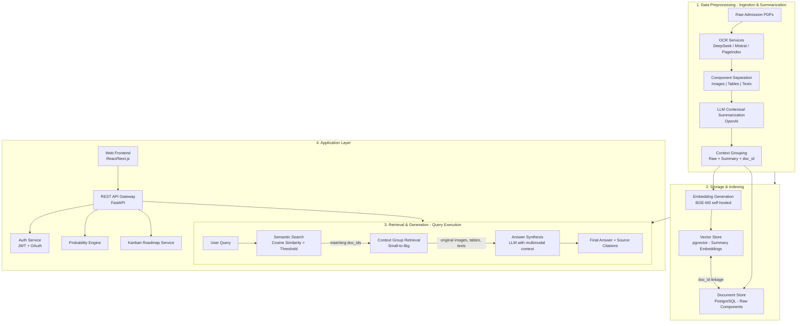
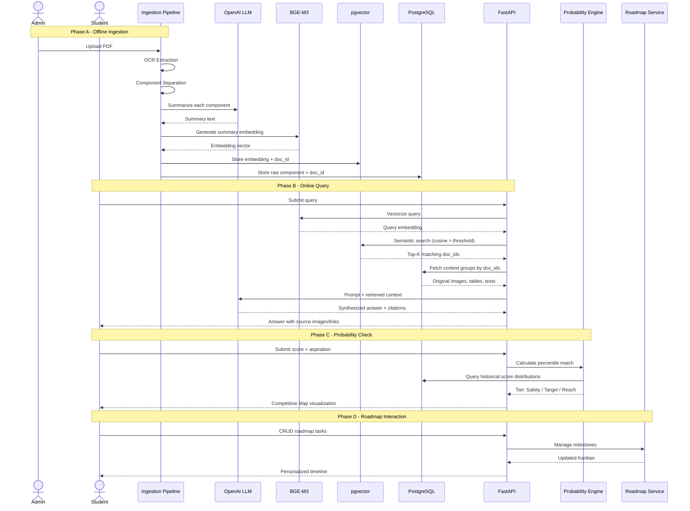
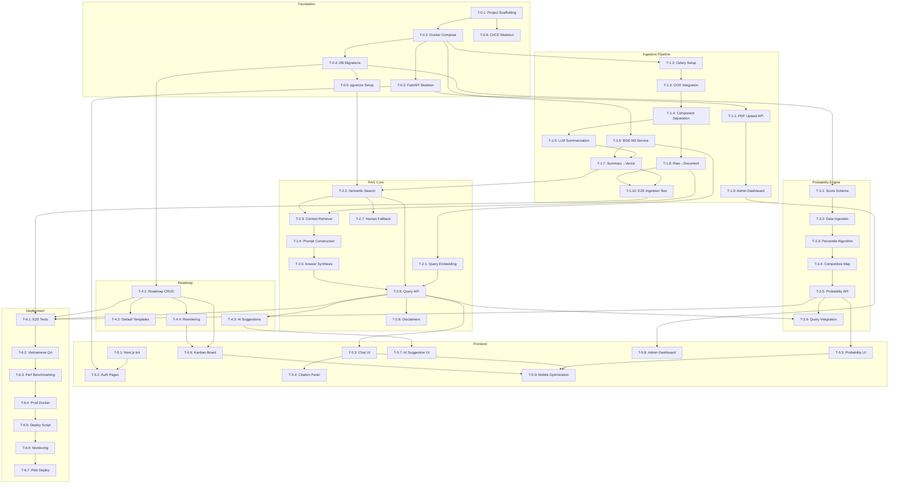

## Executive Summary

This document defines the complete architecture, data flow, and implementation task list for the ScholarSight MVP (Phase 1). The system is an AI-powered academic and admissions consultant for the Vietnamese market, built on a Retrieval-Augmented Generation (RAG) architecture that eliminates hallucinations by always grounding answers in original source documents (images, tables, texts) from official university handbooks.

---

## High-Level System Architecture



---

## Data Flow: End-to-End Trace



---

## Technology Stack

| Layer | Technology | Rationale |
|---|---|---|
| **Frontend** | React + Next.js (TypeScript) | SSR for SEO, rich interactive Kanban UI, mature ecosystem |
| **Backend API** | FastAPI (Python 3.11+) | Async-native, OpenAPI auto-docs, ideal for AI/ML orchestration |
| **Database - Vector** | PostgreSQL + pgvector | Single DB for both vector and relational data, reduces operational complexity |
| **Database - Document** | PostgreSQL (same instance) | Stores raw components; doc_id linkage with pgvector tables |
| **Embedding Model** | BGE-M3 (self-hosted via HuggingFace TEI) | Multilingual (critical for Vietnamese), high MTEB benchmark scores |
| **LLM - Summarization & Synthesis** | OpenAI GPT-4o / GPT-4o-mini | Proven multimodal capabilities, handles Vietnamese well |
| **OCR Services** | DeepSeek OCR, Mistral AI OCR, PageIndex | Three-tier fallback for handling poor-quality Vietnamese academic PDFs |
| **Task Queue** | Celery + Redis | Async ingestion pipeline, retry logic for OCR failures |
| **Cache** | Redis | Session cache, query result cache, rate limiting |
| **Object Storage** | MinIO (self-hosted, S3-compatible) | Store raw PDFs, extracted images; production-ready for VPS |
| **Containerization** | Docker + Docker Compose | Consistent dev/prod environments, easy VPS deployment |
| **Reverse Proxy** | Nginx | SSL termination, static file serving, API gateway routing |

---

## Database Schema Design

### Vector Store (pgvector schema)

```sql
-- Summaries with embeddings
CREATE TABLE summary_embeddings (
    id UUID PRIMARY KEY DEFAULT gen_random_uuid(),
    doc_id UUID NOT NULL,
    component_type TEXT NOT NULL CHECK (component_type IN ('image', 'table', 'text')),
    summary_text TEXT NOT NULL,
    embedding vector(1024),  -- BGE-M3 outputs 1024-dim vectors
    source_page INTEGER,
    university_name TEXT,
    academic_year INTEGER,
    created_at TIMESTAMPTZ DEFAULT now()
);

-- Index for fast ANN search
CREATE INDEX ON summary_embeddings USING ivfflat (embedding vector_cosine_ops)
    WITH (lists = 100);
```

### Document Store (PostgreSQL schema)

```sql
-- Original components
CREATE TABLE raw_components (
    id UUID PRIMARY KEY DEFAULT gen_random_uuid(),
    doc_id UUID NOT NULL,
    component_type TEXT NOT NULL CHECK (component_type IN ('image', 'table', 'text')),
    raw_content TEXT,                    -- For text components
    image_url TEXT,                      -- MinIO URL for image components
    table_structure JSONB,               -- Structured table data
    ocr_source TEXT,                     -- Which OCR service extracted this
    source_file TEXT NOT NULL,           -- Original PDF filename
    source_page INTEGER,
    university_name TEXT,
    academic_year INTEGER,
    ingestion_batch_id UUID,
    created_at TIMESTAMPTZ DEFAULT now()
);

CREATE INDEX idx_raw_components_doc_id ON raw_components(doc_id);
CREATE INDEX idx_raw_components_university ON raw_components(university_name);
```

### Application Tables

```sql
-- Users
CREATE TABLE users (
    id UUID PRIMARY KEY DEFAULT gen_random_uuid(),
    email TEXT UNIQUE NOT NULL,
    password_hash TEXT NOT NULL,
    full_name TEXT,
    role TEXT DEFAULT 'student' CHECK (role IN ('student', 'counselor', 'admin')),
    created_at TIMESTAMPTZ DEFAULT now()
);

-- Query history
CREATE TABLE query_history (
    id UUID PRIMARY KEY DEFAULT gen_random_uuid(),
    user_id UUID REFERENCES users(id),
    query_text TEXT NOT NULL,
    retrieved_doc_ids UUID[],
    synthesized_answer TEXT,
    source_citations JSONB,
    cosine_scores FLOAT[],
    created_at TIMESTAMPTZ DEFAULT now()
);

-- Probability assessments
CREATE TABLE probability_assessments (
    id UUID PRIMARY KEY DEFAULT gen_random_uuid(),
    user_id UUID REFERENCES users(id),
    university_name TEXT,
    major TEXT,
    candidate_score FLOAT,
    tier TEXT CHECK (tier IN ('safety', 'target', 'reach')),
    percentile_rank FLOAT,
    competitive_map_data JSONB,
    created_at TIMESTAMPTZ DEFAULT now()
);

-- Roadmap tasks
CREATE TABLE roadmap_tasks (
    id UUID PRIMARY KEY DEFAULT gen_random_uuid(),
    user_id UUID REFERENCES users(id),
    title TEXT NOT NULL,
    description TEXT,
    status TEXT DEFAULT 'todo' CHECK (status IN ('todo', 'in_progress', 'done')),
    due_month INTEGER CHECK (due_month BETWEEN 1 AND 12),
    category TEXT CHECK (category IN ('exam_prep', 'application', 'document', 'financial', 'other')),
    sort_order INTEGER,
    created_at TIMESTAMPTZ DEFAULT now()
);
```

---

## Task Breakdown

### Phase 0: Foundation & DevOps

| ID | Task | Description | Dependencies |
|---|---|---|---|
| **T-0.1** | Project scaffolding | Initialize monorepo structure with `backend/`, `frontend/`, `docker/`, `scripts/`, `plans/` directories. Set up `.gitignore`, `README.md`, `pyproject.toml`, `package.json`. | None |
| **T-0.2** | Docker Compose development environment | Create `docker-compose.yml` with services: PostgreSQL+pgvector, Redis, MinIO, Nginx. Configure health checks and volume mounts. | T-0.1 |
| **T-0.3** | FastAPI project skeleton | Initialize FastAPI app with CORS middleware, health-check endpoint (`/api/health`), structured logging, error handlers, and OpenAPI tags. | T-0.2 |
| **T-0.4** | Database migrations framework | Set up Alembic for PostgreSQL migrations. Create initial migration for all application tables (`users`, `query_history`, `probability_assessments`, `roadmap_tasks`). | T-0.2 |
| **T-0.5** | pgvector extension setup | Database initialization script that enables `pgvector` extension and creates `summary_embeddings` and `raw_components` tables with proper indexing (IVFFlat). | T-0.2 |
| **T-0.6** | CI/CD pipeline skeleton | GitHub Actions workflow: linting (ruff, eslint), type-checking (mypy, tsc), Docker image build on PR. | T-0.1 |

### Phase 1: Ingestion Pipeline — The "Data Ops" Backbone

| ID | Task | Description | Dependencies |
|---|---|---|---|
| **T-1.1** | PDF upload API endpoint | `POST /api/ingest/upload` — accepts multipart PDF upload, validates file type/size, stores in MinIO, returns `ingestion_batch_id`. | T-0.3 |
| **T-1.2** | Celery task queue setup | Configure Celery with Redis broker. Define task routing: `ocr_extraction`, `summarization`, `embedding_generation` queues. | T-0.2 |
| **T-1.3** | OCR service integration layer | Abstract OCR interface with adapters for DeepSeek OCR, Mistral AI OCR, and PageIndex. Implement fallback logic: primary → secondary → tertiary. Return extracted text + detected components. | T-1.2 |
| **T-1.4** | Component separation module | Parse OCR output and classify into three types: `image` (with bounding-box coordinates), `table` (with cell structure), `text` (plain blocks). Extract and crop images, store in MinIO. | T-1.3 |
| **T-1.5** | LLM contextual summarization | For each component, construct a prompt that includes the raw content and surrounding text. Call OpenAI API to generate a concise descriptive summary. Store summary bound with `doc_id`. Handle rate limits with exponential backoff. | T-1.4 |
| **T-1.6** | BGE-M3 embedding service | Deploy BGE-M3 via HuggingFace Text Embeddings Inference (TEI) in a Docker container. Expose REST endpoint for embedding generation (1024-dim vectors). | T-0.2 |
| **T-1.7** | Summary-to-Vector-Store pipeline | Celery task: take generated summary → call BGE-M3 → insert embedding + metadata into `summary_embeddings` table. | T-1.5, T-1.6 |
| **T-1.8** | Raw component-to-Document-Store pipeline | Celery task: take classified components → insert into `raw_components` table (text/JSONB/image URL). Ensure `doc_id` consistency with T-1.7. | T-1.4 |
| **T-1.9** | Ingestion admin dashboard | Simple admin UI page to upload PDFs, view ingestion status (pending/processing/completed/failed), and inspect extracted components with summaries. | T-1.1 |
| **T-1.10** | End-to-end ingestion integration test | Test with 3 real Vietnamese admission PDFs. Verify: OCR quality → component classification accuracy → summary relevance → embedding searchability → doc_id linkage integrity. | T-1.7, T-1.8 |

### Phase 2: Retrieval & Generation — The "Anti-Hallucination" Core

| ID | Task | Description | Dependencies |
|---|---|---|---|
| **T-2.1** | Query embedding endpoint | `POST /api/query/embed` — accept query text, call BGE-M3, return 1024-dim vector. Internal service, not exposed publicly. | T-1.6 |
| **T-2.2** | Semantic search service | Implement cosine similarity search on `summary_embeddings` using pgvector's `<=>` operator. Apply configurable threshold (default 0.75). Return top-K (default 5) matching `doc_id`s with scores. | T-0.5, T-1.7 |
| **T-2.3** | Context group retrieval (Small-to-Big) | Given a list of `doc_id`s → fetch ALL associated raw components from `raw_components` table. Reconstruct the full "context group": images (as MinIO URLs/base64), tables (as structured data), texts. | T-1.8 |
| **T-2.4** | Prompt construction engine | Build the final LLM prompt with: system message (role, disclaimers, citation requirements), retrieved context groups (with explicit `doc_id` references), user query. Include instructions to cite sources by `doc_id` and surface original images when relevant. | None |
| **T-2.5** | Answer synthesis service | Call OpenAI GPT-4o with the constructed prompt. Parse response to extract: synthesized answer, cited `doc_id`s, any image references. Store full interaction in `query_history`. | T-2.3, T-2.4 |
| **T-2.6** | Query API endpoint | `POST /api/query` — the main public endpoint. Orchestrates: query vectorization → semantic search → context retrieval → answer synthesis. Returns answer with inline source citations and image URLs. | T-2.1, T-2.2, T-2.5 |
| **T-2.7** | Human fallback trigger | Detection logic: if cosine similarity scores are all below threshold OR query contains high-risk keywords (e.g., "guarantee", "chắc chắn đỗ") → return a "Talk to an Expert" redirect response instead of AI-generated answer. | T-2.2 |
| **T-2.8** | Comprehensive disclaimer injection | Every response must prepend a disclaimer: "Đây là công cụ phân tích và gợi ý. Quyết định cuối cùng thuộc về bạn." Add to system prompt and API response wrapper. | T-2.6 |

### Phase 3: Probability Engine — The "Monetization" Feature

| ID | Task | Description | Dependencies |
|---|---|---|---|
| **T-3.1** | Historical score data schema | Create `historical_scores` table: `university_name`, `major`, `academic_year`, `admission_method`, `quota`, `cutoff_score`, `score_distribution` (JSONB of percentile buckets). | T-0.4 |
| **T-3.2** | MoET data ingestion script | Script to parse MoET national score distribution data (CSV/JSON) and populate `historical_scores`. Handle 3-year variance data. | T-3.1 |
| **T-3.3** | Percentile matching algorithm | Implement the core algorithm: given candidate's score + target university/major → find historical percentile rank → apply 3-year variance smoothing → classify into 🟢 Safety (≥90th percentile), 🟡 Target (50-89th), 🔴 Reach (<50th). | T-3.2 |
| **T-3.4** | Competitive Map visualization data | Generate JSON structure for frontend chart: candidate's position marker, historical score distribution curve, tier boundaries. | T-3.3 |
| **T-3.5** | Probability assessment API | `POST /api/probability/assess` — accepts `{score, university, major, admission_method}` → returns tier classification, percentile rank, competitive map data. Store in `probability_assessments`. | T-3.3, T-3.4 |
| **T-3.6** | Probability engine integration with Query | Extend the query endpoint to detect probability-related queries (e.g., "khả năng đỗ", "cơ hội trúng tuyển") and call the probability engine to enrich the response. | T-3.5, T-2.6 |

### Phase 4: Interactive Roadmap — Kanban To-Do List

| ID | Task | Description | Dependencies |
|---|---|---|---|
| **T-4.1** | Roadmap CRUD API | `GET/POST/PUT/DELETE /api/roadmap/tasks` — full REST interface for roadmap tasks. Filter by month, category, status. | T-0.4 |
| **T-4.2** | Default milestone templates | Seed database with default monthly milestones for the Vietnamese admissions calendar (e.g., March: Ôn thi chuẩn hóa, April: Nộp hồ sơ, June: Thi THPT, July: Công bố điểm). Loaded on user registration. | T-4.1 |
| **T-4.3** | AI-powered task suggestion | `POST /api/roadmap/suggest` — given user's profile (grade, target universities, current month), LLM suggests personalized tasks. User can accept or dismiss suggestions. | T-2.6 |
| **T-4.4** | Roadmap reordering API | `PUT /api/roadmap/reorder` — accepts array of `{task_id, sort_order}` to support drag-and-drop Kanban. | T-4.1 |

### Phase 5: Frontend — User-Facing Application

| ID | Task | Description | Dependencies |
|---|---|---|---|
| **T-5.1** | Next.js project initialization | Initialize with TypeScript, Tailwind CSS, shadcn/ui components. Set up folder structure: `app/`, `components/`, `lib/`, `hooks/`, `types/`. | None |
| **T-5.2** | Authentication pages | Login/Register pages with email+password. JWT token management (HttpOnly cookie or secure storage). Protected route middleware. | T-0.3 |
| **T-5.3** | Chat interface — Query input | Chat-like UI component with text input, loading states, and streaming response display. Show source citations as clickable badges that reveal original images/tables in a side panel. | T-2.6 |
| **T-5.4** | Source citation panel | Side panel that displays the original source documents (images, tables, text excerpts) for the citations referenced in the AI answer. This is the "trust-building" UI element. | T-5.3 |
| **T-5.5** | Probability engine UI | Input form: score, university dropdown (searchable), major dropdown. Output: tier badge (colored), percentile gauge chart, competitive map visualization (using Recharts or D3.js). | T-3.5 |
| **T-5.6** | Kanban roadmap board | Three-column Kanban board (Todo / In Progress / Done) with drag-and-drop. Task cards show title, due month badge, category tag. Month filter dropdown. | T-4.1, T-4.4 |
| **T-5.7** | AI task suggestion UI | "Get AI Suggestions" button on the roadmap page. Displays suggested tasks in a modal; user can select which ones to add with checkboxes. | T-4.3 |
| **T-5.8** | Admin ingestion dashboard | Upload PDFs, view ingestion batch status table, inspect individual components (image viewer, table renderer, text display). Paginated list of all ingested documents. | T-1.9 |
| **T-5.9** | Responsive layout & mobile optimization | Ensure all pages work on mobile devices (Vietnamese students primarily use smartphones). Bottom navigation bar for mobile. | T-5.3, T-5.5, T-5.6 |

### Phase 6: Integration, Testing & Deployment

| ID | Task | Description | Dependencies |
|---|---|---|---|
| **T-6.1** | End-to-end integration tests | Test full flow: PDF upload → ingestion → query → probability assessment → roadmap interaction. Verify doc_id linkage end-to-end. | All Phase 1-5 |
| **T-6.2** | Vietnamese language quality assessment | Manual review of: OCR accuracy on Vietnamese text (diacritics), LLM summary quality in Vietnamese, response naturalness and cultural appropriateness. | T-1.10, T-2.6 |
| **T-6.3** | Performance benchmarking | Measure: query latency (target <3s p95), embedding generation throughput, semantic search speed with 10K+ summaries, PDF ingestion time per page. | T-6.1 |
| **T-6.4** | Production Docker Compose | Production-optimized `docker-compose.prod.yml` with resource limits, restart policies, separate networks, and secrets management. | T-6.3 |
| **T-6.5** | VPS deployment script | Bash script to provision a VPS (Ubuntu 22.04): install Docker, clone repo, set up environment variables, launch production stack, configure Nginx SSL with Certbot. | T-6.4 |
| **T-6.6** | Monitoring & alerting setup | Prometheus metrics endpoint on FastAPI, Grafana dashboard for: query volume, latency percentiles, ingestion pipeline status, error rates, LLM API cost tracking. | T-6.4 |
| **T-6.7** | Pilot deployment | Deploy to production VPS. Configure DNS, SSL. Create test accounts for pilot partners (IELTS centers, private high schools). | T-6.5, T-6.6 |

---

## Directory Structure

```
ScholarSight/
├── backend/
│   ├── app/
│   │   ├── api/
│   │   │   ├── routes/
│   │   │   │   ├── health.py
│   │   │   │   ├── ingest.py
│   │   │   │   ├── query.py
│   │   │   │   ├── probability.py
│   │   │   │   ├── roadmap.py
│   │   │   │   └── auth.py
│   │   │   └── deps.py
│   │   ├── core/
│   │   │   ├── config.py
│   │   │   ├── security.py
│   │   │   └── logging.py
│   │   ├── db/
│   │   │   ├── session.py
│   │   │   ├── migrations/
│   │   │   └── models/
│   │   ├── services/
│   │   │   ├── ocr/
│   │   │   │   ├── base.py
│   │   │   │   ├── deepseek_ocr.py
│   │   │   │   ├── mistral_ocr.py
│   │   │   │   └── pageindex.py
│   │   │   ├── llm/
│   │   │   │   ├── summarizer.py
│   │   │   │   └── synthesizer.py
│   │   │   ├── embedding/
│   │   │   │   └── bge_m3.py
│   │   │   ├── retrieval/
│   │   │   │   ├── semantic_search.py
│   │   │   │   └── context_retriever.py
│   │   │   ├── probability/
│   │   │   │   ├── percentile_matcher.py
│   │   │   │   └── competitive_map.py
│   │   │   └── roadmap/
│   │   │       └── templates.py
│   │   └── tasks/
│   │       ├── celery_app.py
│   │       ├── ocr_tasks.py
│   │       ├── summarization_tasks.py
│   │       └── embedding_tasks.py
│   ├── tests/
│   └── pyproject.toml
├── frontend/
│   ├── app/
│   │   ├── layout.tsx
│   │   ├── page.tsx
│   │   ├── chat/
│   │   ├── probability/
│   │   ├── roadmap/
│   │   └── admin/
│   ├── components/
│   │   ├── ui/          (shadcn)
│   │   ├── chat/
│   │   ├── roadmap/
│   │   └── admin/
│   ├── lib/
│   │   ├── api.ts
│   │   └── auth.ts
│   └── package.json
├── docker/
│   ├── docker-compose.yml
│   ├── docker-compose.prod.yml
│   ├── nginx/
│   │   └── default.conf
│   └── Dockerfile.backend
├── scripts/
│   ├── init_db.sh
│   ├── deploy.sh
│   └── seed_data.py
└── plans/
    └── mvp-architecture-and-task-breakdown.md
```

---

## Execution Order & Dependencies



---

## Key Design Decisions & Rationale

1. **Single PostgreSQL instance for both vector and document stores**: Reduces operational complexity vs. separate pgvector + MongoDB/MinIO-only. The `raw_components` table stores text and JSONB inline; images are stored in MinIO with URLs in PostgreSQL. This keeps `doc_id` linkage trivially consistent via foreign keys and JOINs.

2. **Self-hosted BGE-M3 over OpenAI embeddings**: BGE-M3 is explicitly designed for multilingual retrieval (including Vietnamese) and costs $0 for inference beyond the GPU/compute. OpenAI embeddings would incur per-token costs at scale and may underperform on Vietnamese.

3. **Small-to-Big retrieval pattern**: This is the cornerstone anti-hallucination mechanism. We retrieve summaries first (fast, semantic), then pull the full original context (heavy, complete). This means the LLM always sees the original source material, not just a summary—critical for accurate citations.

4. **Three-OCR fallback chain**: Vietnamese academic PDFs are notoriously poorly formatted (scanned seals, complex tables, mixed Vietnamese/English). A single OCR service will fail on some documents. The fallback chain (DeepSeek → Mistral → PageIndex) maximizes extraction reliability.

5. **Celery for async ingestion, not request-response**: PDF processing + OCR + summarization + embedding generation can take minutes per document. Blocking the HTTP request would be unacceptable. Celery provides retry logic, monitoring, and horizontal scaling.

6. **Probability engine as separate bounded context**: The percentile matching logic operates on structured historical data, independent of the RAG pipeline. Keeping it separate allows independent iteration, testing, and (eventually) monetization gating.

---

## Summary of Task Count by Phase

| Phase | Task Count | Focus |
|---|---|---|
| Phase 0: Foundation & DevOps | 6 | Project setup, containers, DB schemas |
| Phase 1: Ingestion Pipeline | 10 | PDF→OCR→Summarize→Embed→Store |
| Phase 2: RAG Core | 8 | Semantic search, retrieval, synthesis |
| Phase 3: Probability Engine | 6 | Percentile matching, competitive map |
| Phase 4: Roadmap | 4 | Kanban CRUD, templates, AI suggestions |
| Phase 5: Frontend | 9 | Chat UI, probability UI, Kanban, admin |
| Phase 6: Integration & Deployment | 7 | Testing, QA, production deployment |
| **Total** | **50** | |

---

## Risk Mitigation Checklist

- [ ] **OCR quality on Vietnamese diacritics**: Validate with 10+ real admission PDFs before committing to OCR providers.
- [ ] **OpenAI API cost estimation**: Calculate expected tokens per query × projected user volume; set budget alerts.
- [ ] **BGE-M3 GPU requirements**: Verify self-hosting feasibility on target VPS; fallback to CPU inference with ONNX optimization if GPU unavailable.
- [ ] **Legal review of disclaimers**: Have a Vietnamese legal professional review the disclaimer text and "Talk to an Expert" fallback language.
- [ ] **Data freshness**: Admission handbooks change annually. Design ingestion pipeline to support re-ingestion and versioning (academic_year field already in schema).