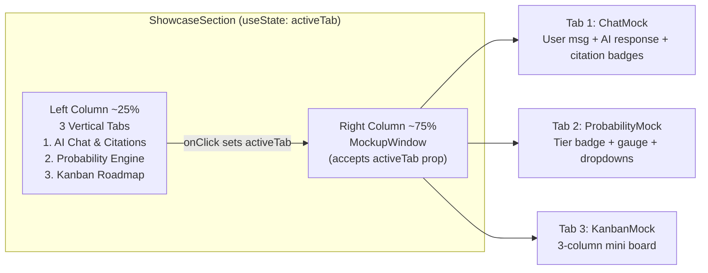

# Showcase Section Refactor Plan

## Goal

Replace the current static split-pane ShowcaseSection with an **interactive tab-driven** layout. The left column has 3 vertical feature toggle buttons; the right column shows a macOS-style mockup window whose content changes via `useState`.

## Architecture

## Files Changed

| File | Action | What Changes |
|---|---|---|
| [`ShowcaseSection.tsx`](frontend/src/components/landing/ShowcaseSection.tsx) | **Rewrite** | Add `useState`, vertical tab list, pass `activeTab` to MockupWindow |
| [`MockupWindow.tsx`](frontend/src/components/landing/MockupWindow.tsx) | **Rewrite** | Accept `activeTab` prop, remove internal nav bar, remove hardcoded split-pane, conditionally render ChatMock/ProbabilityMock/KanbanMock |
| [`ChatMock.tsx`](frontend/src/components/landing/ChatMock.tsx) | **Tweak** | Update text: "2025 MoET data" instead of 2024, cutoff "27.2" instead of 27.0, remove the inline citation reference chips (keep superscript badges) |
| [`ProbabilityMock.tsx`](frontend/src/components/landing/ProbabilityMock.tsx) | **Enhance** | Add 2 dummy Select dropdowns: "University" (HUST selected) and "Major" (Computer Science selected) using our existing shadcn Select |
| [`KanbanMock.tsx`](frontend/src/components/landing/KanbanMock.tsx) | **New** | Mini 3-column Kanban board: To Do / In Progress / Done with mock task cards |

## Component Details

### ShowcaseSection.tsx

- `const [activeTab, setActiveTab] = useState<"chat" | "probability" | "roadmap">("chat")`
- Vertical tab list: each tab is a `<button>` with:
  - Active: `bg-zinc-900 text-white rounded-xl font-semibold`
  - Inactive: `bg-gray-100 text-gray-700 rounded-lg hover:bg-gray-200`
- Tab icons: MessageSquare, BarChart3, Kanban from lucide-react
- Desktop: `grid grid-cols-[1fr_3fr]` (25%/75% roughly)
- Mobile: stack vertically (tabs on top as horizontal scroll pills)

### MockupWindow.tsx

- Props: `activeTab: "chat" | "probability" | "roadmap"`
- macOS chrome bar: 3 dots + centered "admissions-ai-demo" text — no inner nav bar
- Body: `if (activeTab === "chat") <ChatMock />`, etc.
- Uses a simple conditional render pattern (no Tabs component — just if/else)

### KanbanMock.tsx

- 3 equal columns with headers: "To Do", "In Progress", "Done"
- Mock cards inside:
  - To Do: "Prepare SAT documents (AI Suggested)" with a light blue left accent
  - In Progress: "Review Math for High School Graduation Exam" with a light amber left accent
  - Done: empty column with dashed border placeholder

### ChatMock.tsx Tweak

- Change: "2024 MoET Admissions Regulation" → "2025 MoET data"
- Change: "2024 cutoff for Computer Science (IT) was 27.0" → "cutoff for IT at HUST was 27.2"
- Keep the superscript citation badges `[1]` `[2]`
- Remove the bottom citation reference chips (they were in the old split-pane layout)

### ProbabilityMock.tsx Enhancement

- Add 2 shadcn `Select` components at the top (read-only/mock):
  - University: dropdown showing "Hanoi University of Science and Technology"
  - Major: dropdown showing "Computer Science (IT)"
- Keep existing tier badge, progress gauge, score/cutoff cards, and distribution histogram

## Why This Approach

- Reuses 80% of existing ChatMock and ProbabilityMock code
- Minimal new code (just KanbanMock + ShowcaseSection rewrite)
- `useState` in ShowcaseSection is the only state needed — no complex state management
- MockupWindow becomes a simple shell; the old internal nav bar is unnecessary since the left tabs handle navigation
- The old split-pane (chat + probability side-by-side) is replaced with full-width focused views per tab — cleaner and more impactful